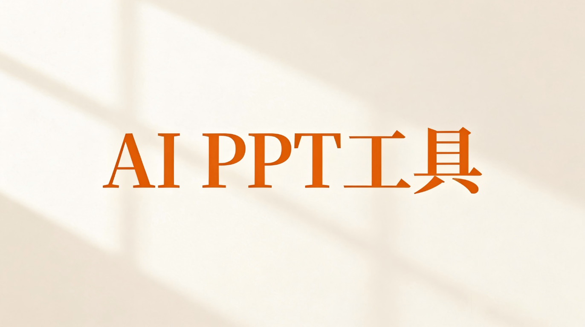
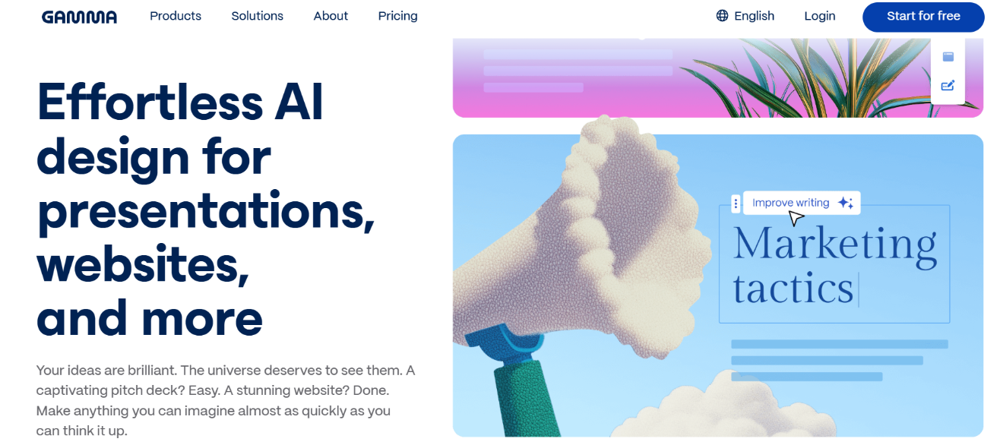
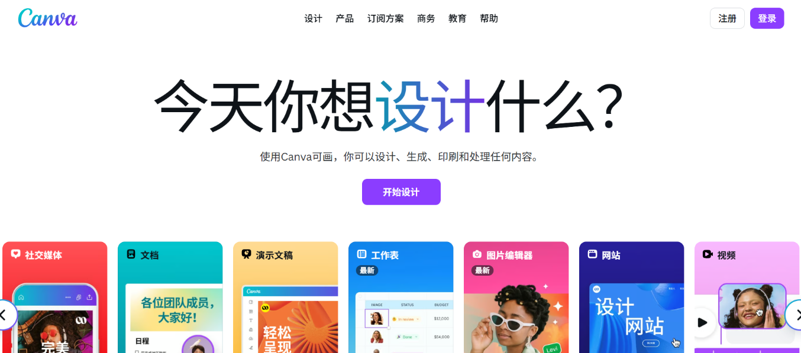

# AI PPT演示工具选购指南：如何为你的场景匹配最佳搭档

在 2026 年，AI 制作 PPT 早已不是什么新鲜事。市面上的工具层出不穷，每一个都标榜自己是“效率神器”。但作为用户，我们往往面临的真实困境是：**工具太多，不知道选哪个才真正顺手。**

与其迷信某个单一的“排名”，不如从你的**核心使用场景**出发。经过对市面上主流产品的深度调研与实测，我们剥离了营销话术，为你梳理出这份基于真实工作流的选购参考。我们不再单纯看“功能多寡”，而是聚焦于：**它能否真正解决你当下的痛点？**

以下是针对不同需求维度的深度解析与推荐。

---

## 01. 视觉叙事与创意表达的首选：Gamma

**推荐人群：** 创意工作者、初创团队创始人、需要快速输出极具设计感方案的用户。

**核心体验：**

Gamma 的本质与其说是一个 PPT 工具，不如说是一个“网页化的内容生成器”。它打破了传统幻灯片的画布限制，更像是在搭建一个流动的数字故事。

- **优势解析：**
    - **设计美学的“降维打击”：** Gamma 最大的杀手锏在于其默认的审美在线。你不需要懂配色和排版，AI 生成的每一页都自带现代感和高级感，非常适合制作产品概念介绍或个人作品集。
    - **所见即所得的流畅感：** 它的编辑体验非常顺滑，模块化的拖拽操作让修改内容就像搭积木一样简单。
    - **灵活的分享形式：** 支持生成网页链接直接分享，在移动端的阅读体验远优于传统 PPT。
- **避坑指南：**
    - 如果你需要严格遵循传统的“每页只有三个要点”的汇报格式，或者需要打印成册，Gamma 的流式布局可能会让你在分页调整上感到头大。
    - 在处理复杂的中文长文档逻辑时，它的 AI 有时会过于“发散”，导致内容偏离原意。

---

## 02. 品牌一致性与素材库的王者：Canva（可画）

**推荐人群：** 市场营销人员、新媒体运营、对品牌视觉有严格要求的团队。

**核心体验：**

如果你本身就是 Canva 的用户，那么直接使用它的 AI 功能是最高效的选择。它不是在重新发明 PPT，而是将 AI 植入到了一个庞大的设计生态中。

- **优势解析：**
    - **素材库即是生产力：** 背靠千万级的版权图片、字体和插画资源，Canva 生成的 PPT 绝不会让你感到“素材匮乏”。
    - **视觉魔法：** 内置的 AI 文生图、魔法编辑等功能，让你在做 PPT 的同时就能完成修图和素材创作，无需在多个软件间反复横跳。
    - **团队协作基因：** 非常适合多人在线协作，统一品牌色和字体规范非常方便。
- **避坑指南：**
    - 它的核心强项依然是“平面设计”而非“逻辑梳理”。如果你丢给它一份两万字的深度行业报告，它生成的大纲逻辑可能比较浅显，需要人工进行大量的结构调整。

---

## 03. 非线性叙事的探索者：Tome

**推荐人群：** 追求新颖演示体验的个人创作者、甚至是用 PPT 讲故事的人。

**核心体验：**

Tome 走了一条少有人走的路。它试图彻底重构“演示”的定义，让 PPT 变得像翻阅一本交互式的画册。

- **优势解析：**
    - **沉浸式阅读：** 极简的界面设计，让观众的注意力完全集中在内容本身。
    - **打破线性束缚：** 适合用来展示非结构化的内容，比如一个灵感拼贴板、一个心情故事或者一个非正式的项目原型。
- **避坑指南：**
    - 对于习惯了图表、数据分析和严谨排版的职场人来说，Tome 目前的功能显得过于“文艺”。它缺乏深度编辑图表和复杂数据可视化的能力，很难胜任严肃的商业汇报。

---

## 04. 决策地图：一分钟找到你的本命工具

为了帮你节省试错时间，我们摒弃了复杂的参数对比，直接从**“你要做什么”**反推**“你该用什么”**。

| **你的核心场景** | **你的首要痛点** | **建议选择** | **核心理由** |
| --- | --- | --- | --- |
| **创意提案 / 产品发布** | 需要视觉冲击力，不想花时间调格式 | **Gamma** | 默认设计极佳，所见即所得，不仅是 PPT 更是网页。 |
| **营销物料 / 团队协作** | 需要海量素材，必须符合品牌规范 | **Canva** | 依托强大的设计生态库，视觉处理能力强，协作顺滑。 |
| **个人作品 / 故事讲述** | 想要与众不同，厌倦了传统翻页 | **Tome** | 提供非线性的沉浸式体验，适合感性表达。 |
| **极简任务 / 临时汇报** | 只是想快速弄个草稿交差 | **入门级 AI 工具** | 门槛低，操作傻瓜，能用就行。 |
| **严肃报告 / 学术答辩** | **内容决不能错**，格式必须严谨 | *(建议寻找专注于“文档转 PPT”且具备原文锁定功能的专业工具)* | 这类场景需要 AI 克制“创造欲”，严格忠实于原文档逻辑。 |

---

## 结语：工具是手段，表达是核心

2026 年的 AI PPT 市场已经进入了**细分化**阶段。

- 如果你追求**美感和创意**，Gamma 和 Canva 是你的左右手；
- 如果你追求**新奇的叙事**，Tome 值得一试；
- 如果你处于**严肃的商业或学术环境**，则需要寻找那些能深度理解长文档、并且尊重原文逻辑的专业级工具。

没有绝对完美的万能工具，只有最契合当下场景的解决方案。希望这份指南能帮你拨开迷雾，让 AI 真正成为你思想的扩音器，而不是格式的搬运工。