**码字不易，希望大家能多多点赞！**

---

**2023.08.26最新消息，本文已经撰写Stable Diffusion 1.x-2.x系列和对应LoRA的训练全流程与详细解读内容，同时发布对应的保姆级训练资源，大家可以愉快地训练属于自己的SD和LoRA模型了！**

**2023.07.26最新消息，由于Stable Diffusion模型的网络结构比较复杂，不好可视化，导致大家看的云里雾里。因此本文中已经发布Stable Diffusion中VAE，U-Net和CLIP三大模型的可视化网络结构图，大家可以下载用于学习！**

---

大家好，我是油炸PPT老师。

2022年， **Stable Diffusion模型横空出世，成为AI行业从传统深度学习时代走向AIGC时代的标志性模型之一** ，并为工业界、投资界、学术界和竞赛界都注入了新的AI想象空间， **让AI再次“性感”** 。

**Stable Diffusion（简称SD）是AI绘画领域的一个核心模型** ，能够进行文生图（txt2img）和图生图（img2img）等图像生成任务。 **与Midjourney不同的是，Stable Diffusion是一个完全开源的项目（模型、代码、训练数据、论文、生态等全部开源），这使得其能快速构建强大繁荣的上下游生态（AI绘画社区、基于SD的自训练AI绘画模型、丰富的辅助AI绘画工具与插件等），并且吸引了越来越多的AI绘画爱好者加入其中，与AI行业从业者一起推动AIGC领域的发展与普惠。**

也正是Stable Diffusion的开源属性、繁荣的上下游生态以及各行各业AI绘画爱好者的参与，使得AI绘画火爆出圈，让AI绘画的影响触达到了全球各行各业人们的生活中。 **可以说，AI绘画的ToC普惠在AIGC时代的早期就已经显现，这是之前的传统深度学习时代从未有过的。而ToC普惠也是最让油炸PPT老师兴奋的AIGC属性，让油炸PPT老师相信未来的十五年会是像移动互联网时代那样，充满科技变革与机会的时代。**

油炸PPT老师从传统深度学习时代走来，与图像分类领域的ResNet系列、图像分割领域的U-Net系列以及目标检测领域的YOLO系列模型打过多年交道， **油炸PPT老师相信Stable Diffusion是AI绘画领域的“YOLO”** 。


Stable Diffusion生成图片示例

因此本文中， **油炸PPT老师将以AI绘画开源社区中最为火爆的Stable Diffusion 1.5模型为例，对Stable Diffusion模型的全维度各个细节做一个深入浅出的分析与总结** （SD模型结构解析、SD模型经典应用场景介绍、SD模型性能优化、SD模型从0到1保姆级训练教程，SD模型不同AI绘画框架从0到1推理运行保姆级教程、最新SD模型资源汇总分享、SD相关配套工具使用等），和大家一起交流学习，让我们能快速地入门Stable Diffusion及其背后的AIGC领域，在AIGC时代中更好地融入和从容。

# 1. Stable Diffusion系列资源

- SD 1.4官方项目： [CompVis/stable-diffusion](https://link.zhihu.com/?target=https%3A//github.com/CompVis/stable-diffusion)
- SD 1.5官方项目： [runwayml/stable-diffusion](https://link.zhihu.com/?target=https%3A//github.com/runwayml/stable-diffusion)
- SD 2.x官方项目： [Stability-AI/stablediffusion](https://link.zhihu.com/?target=https%3A//github.com/Stability-AI/stablediffusion)
- diffusers库中的SD代码pipelines： [diffusers/pipelines/stable_diffusion](https://link.zhihu.com/?target=https%3A//github.com/huggingface/diffusers/tree/main/src/diffusers/pipelines/stable_diffusion)
- SD核心论文： [High-Resolution Image Synthesis with Latent Diffusion Models](https://link.zhihu.com/?target=https%3A//arxiv.org/abs/2112.10752)
- SD Turbo技术报告： [adversarial_diffusion_distillation](https://link.zhihu.com/?target=https%3A//static1.squarespace.com/static/6213c340453c3f502425776e/t/65663480a92fba51d0e1023f/1701197769659/adversarial_diffusion_distillation.pdf)
- **SD模型权重百度云网盘** ：关注油炸PPT老师的公众号 **WeThinkIn，** 后台回复： **SD模型** ，即可获得资源链接，包含 **Stable Diffusion 1.4模型权重、Stable Diffusion 1.5模型权重、Stable Diffusion I npainting 模型权重、Stable Diffusion 2 base（512x512）模型权重、Stable Diffusion 2（768x768）模型权重、Stable Diffusion 2 Inpainting模型权重、Stable Diffusion 2.1 base（512x512）模型权重、Stable Diffusion 2.1（768x768）模型权重、Stable Diffusion Turbo模型权重、S table Diffusion x4 Upscaler （超分）模型权重以及consistency-decoder模型权重** 。不同格式的模型权重比如safetensors格式、ckpt格式、diffusers格式、FP16精度格式、ONNX格式、flax/jax格式以及openvino格式等均已包含。
- **SD保姆级训练资源百度云网盘：** 关注油炸PPT老师的公众号 **WeThinkIn，** 后台回复： **SD-Train** ，即可获得资源链接，包含 **数据处理、SD模型微调训练以及基于SD的LoRA模型训练代码全套资源** ，帮助大家从0到1快速上手训练属于自己的SD AI绘画模型。 **更多SD训练资源使用教程，请看本文第六章内容** 。
- **Stable Diffusion中VAE，U-Net和CLIP三大模型的可视化网络结构图下载：** 关注油炸PPT老师的公众号 **WeThinkIn，** 后台回复： **SD网络结构** ，即可获得网络结构图资源链接。
- Stable Diffusion第三方模型资源： [civitai](https://link.zhihu.com/?target=https%3A//civitai.com/) （全球最全的SD模型资源库）和 [huggingface/models](https://link.zhihu.com/?target=https%3A//huggingface.co/models) （huggingface模型网站）
- Stable Diffusion热门社区： [reddit/StableDiffusion](https://link.zhihu.com/?target=https%3A//www.reddit.com/r/StableDiffusion/) （全球讨论最激烈的SD资讯论坛）

油炸PPT老师会持续把更多Stable Diffusion的资源更新发布到本节中，让大家更加方便的查找SD系列模型的最新资讯。

# **2. 零基础深入浅出理解Stable Diffusion核心基础原理**

## **2.1 通俗讲解Stable Diffusion模型工作流程（包含详细图解）**

Stable Diffusion（SD）模型是由 Stability AI 和 LAION 等公司共同开发的 **生成式模型** ，总共有 **1B左右的参数量** ，可以用于文生图，图生图，图像inpainting，ControlNet控制生成，图像超分等丰富的任务，本节中我们以 **文生图（txt2img）** 和 **图生图（img2img）** 任务展开对Stable Diffusion模型的工作流程进行通俗的讲解。

**文生图任务是指将一段文本输入到SD模型中** ，经过一定的迭代次数， **SD模型输出一张符合输入文本描述的图片** 。比如下图中输入了“天堂，巨大的，海滩”，于是SD模型生成了一个美丽沙滩的图片。


SD模型的文生图（txt2img）过程

**而图生图任务在输入本文的基础上，再输入一张图片** ，SD模型将根据文本的提示， **将输入图片进行重绘以更加符合文本的描述。** 比如下图中，SD模型将“海盗船”添加在之前生成的那个美丽的沙滩图片上。


SD模型的图生图（img2img）过程

**那么输入的文本信息如何成为SD模型能够理解的机器数学信息呢？**

很简单，我们需要给SD模型一个 **文本信息与机器数据信息之间互相转换的“桥梁”——CLIP Text Encoder模型** 。如下图所示，我们使用CLIP Text Encoder模型作为SD模型中的 **前置模块** ，将输入的文本信息进行编码，生成与文本信息对应的Text Embeddings特征矩阵，再将Text Embeddings用于SD模型中来控制图像的生成：


蓝色框就是CLIP Text Encoder模型，能够将输入文本信息进行编码，输出SD能够理解的特征矩阵

完成对文本信息的编码后，就会输入到SD模型的“图像优化模块”中对图像的优化进行“控制”。

如果是图生图任务，我们在输入文本信息的同时，还需要将原图片通过图像编码器（VAE Encoder）生成Latent Feature（隐空间特征）作为输入。

如果是文生图任务，我们只需要输入文本信息，再用random函数生成一个 **高斯噪声矩阵作为** Latent Feature的“替代”输入到SD模型的“图像优化模块”中。

**“图像优化模块”作为SD模型中最为重要的模块，其工作流程是什么样的呢？**

首先，“图像优化模块”是由一个 **U-Net网络** 和一个 **Schedule算法** 共同组成，U-Net网络负责预测噪声， **不断优化生成过程，在预测噪声的同时不断注入文本语义信息** 。而 **schedule算法对每次U-Net预测的噪声进行优化处理（动态调整预测的噪声，控制U-Net预测噪声的强度）** ，从而统筹 **生成过程的进度** 。在SD中，U-Net的迭代优化步数（Timesteps）大概是50或者100次，在这个过程中Latent Feature的质量不断的变好（ **纯噪声减少，图像语义信息增加，文本语义信息增加** ）。整个过程如下图所示：

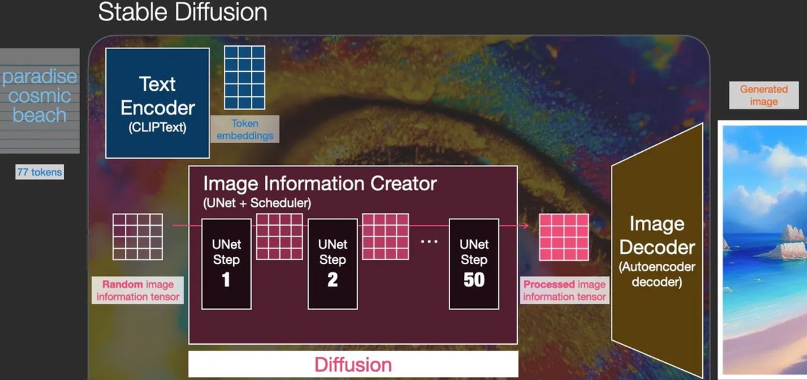

U-Net网络+Schedule算法的迭代去噪过程

U-Net网络和Schedule算法的工作完成以后，SD模型会将优化迭代后的Latent Feature输入到图像解码器（VAE Decoder）中，将Latent Feature重建成像素级图像。

我们对比一下文生图任务中，初始Latent Feature和经过SD的“图像优化模块”处理后，再用图像解码器重建出来的图片之间的区别：


初始Latent Feature和经过SD的“图像优化模块”处理后的图像内容区别

可以看到，上图左侧是初始Latent Feature经过图像解码器重建后的图片，显然是一个纯噪声图片；上图右侧是经过SD的“图像优化模块”处理后，再用图像解码器重建出来的图片，可以看到是一个张包含丰富内容信息的有效图片。

我们再将U-Net网络+Schedule算法的迭代去噪过程的每一步结果都用图像解码器进行重建，我们可以直观的感受到从纯噪声到有效图片的全过程：


U-Net网络+Schedule算法的迭代去噪过程的每一步结果

以上就是SD模型工作的完整流程，下面油炸PPT老师再将其进行总结归纳制作成完整的Stable Diffusion前向推理流程图，方便大家更好的理解SD模型的前向推理过程：


SD模型文生图和图生图的前向推理流程图

## 2.2 从0到1读懂Stable Diffusion模型核心基础原理（包含详细图解）

在传统深度学习时代，凭借生成器与判别器对抗训练的开创性哲学思想，GAN（Generative adversarial networks）可谓是在生成式模型中一枝独秀。同样的， **在AIGC时代，以SD模型为代表的扩散模型接过GAN的衣钵，在AI绘画领域一路“狂飙”** 。

与GAN等生成式模型一致的是， **SD模型同样学习拟合训练集分布，并能够生成与训练集分布相似的输出结果，但与GAN相比，SD模型训练过程更稳定，而且具备更强的泛化性能** 。这些都归功于扩散模型中核心的 **前向扩散过程（Forward Diffusion Process）** 和 **反向扩散过程（Reverse Diffusion Process）。**

在前向扩散过程中，SD模型持续对一张图像添加高斯噪声直至变成 **随机噪声矩阵。** 而在反向扩散过程中，SD模型进行 **去噪声过程** ，将一个随机噪声矩阵逐渐去噪声直至生成一张图像。具体流程与图解如下所示：

- 前向扩散过程（Forward Diffusion Process） → \rightarrow 图片中持续添加噪声
- 反向扩散过程（Reverse Diffusion Process） → \rightarrow 持续去除图片中的噪声


SD模型的加噪和去噪图解

### **【1】扩散模型的基本原理**

在Stable Diffusion这个扩散模型中，无论是前向扩散过程还是反向扩散过程都是一个 **参数化的马尔可夫链（Markov chain），如下图所示：**


扩散模型的前向扩散过程和反向生成过程

看到这里，大家是不是感觉概念有点复杂了，don‘t worry，油炸PPT老师在本文不会讲太多复杂难懂的公式， **大家只要知道Stable Diffusion模型的整个流程遵循参数化的马尔可夫链，前向扩散过程是对图像增加噪声，反向扩散过程是去噪过程即可，对于面试、工业界应用、竞赛界厮杀来说，都已经足够了。**

如果有想要深入理解扩散模型数学原理的读者，油炸PPT老师这里推荐阅读原论文： [Denoising Diffusion Probabilistic Models](https://link.zhihu.com/?target=https%3A//arxiv.org/pdf/2006.11239.pdf)

**油炸PPT老师再从AI绘画应用角度解释一下扩散模型的基本原理，让大家能够对扩散模型有更多通俗易懂的认识：**

“如果从艺术和美学的角度来理解扩散模型，我们可以将其视为一种创作过程。想象这种情况，艺术家在画布的一角开始创作，颜色和形状逐渐扩散到整个画布。每一次画笔的触碰都可能对画布的其他部分产生影响，形成新的颜色和形状的组合。这就像是信息或行为在网络中的传播，每一个节点的改变都可能影响到其他节点。

此外，扩散过程也可以看作是一种艺术表达。例如，抽象派艺术家可能会利用颜色和形状的扩散来表达他们的想法和感情。这种扩散过程可以看作是一种元素间的动态交互，就像在社会网络中，人们通过交流和互动来传播信息和影响他人的行为。

美学角度则可以从扩散模型展现的和谐、平衡、动态等特性来解读。扩散过程中的动态平衡，反映了美学中的对称和平衡的原则。同时，扩散过程的不确定性和随机性，也反映了现代美学中对创新和突破的追求。

总的来说，从艺术和美学的角度来看，扩散模型可以被理解为一种创作和表达过程，其中的元素通过互动和影响，形成一种动态的、有机的整体结构。”

### **【2】前向扩散过程详解**

接下来，我们再详细分析一下前向扩散过程， **其是一个不断加噪声的过程** 。我们举个例子，如下图所示，我们在猫的图片中多次增加高斯噪声直至图片变成随机噪音矩阵。可以看到， **对于初始数据，我们设置K步的扩散步数，每一步增加一定的噪声，如果我们设置的K足够大，那么我们就能够将初始数据转化成随机噪音矩阵** 。

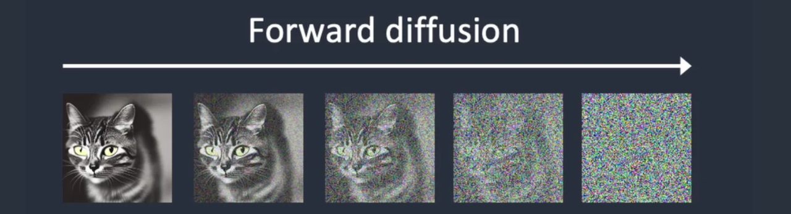

扩散模型的前向扩散过程

一般来说，**扩散过程是固定的，由上节中提到的 Schedule 算法进行统筹控制**。同时扩散过程也有一个重要的性质：我们可以基于初始数据 $x_0$ 和任意的扩散步数 $t$，直接采样得到对应的数据 $x_t$。

### **【3】反向扩散过程详解**

反向扩散过程和前向扩散过程正好相反， **是一个不断去噪的过程** 。下面是一个直观的例子，将随机高斯噪声矩阵通过扩散模型的Inference过程，预测噪声并逐步去噪，最后生成一个小别墅的有效图片。

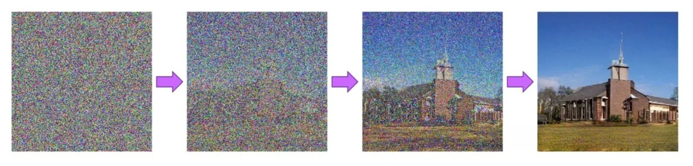

扩散模型的反向生成过程

其中每一步预测并去除的噪声分布，都需要扩散模型在训练中学习。

讲好了扩散模型的前向扩散过程和反向扩散过程，他们的目的都是服务于扩散模型的训练， **训练目标也非常简单：扩散模型每次预测出的噪声和每次实际加入的噪声做回归，让扩散模型能够准确的预测出每次实际加入的真实噪声。**

下面是SD反向扩散过程的完整图解：

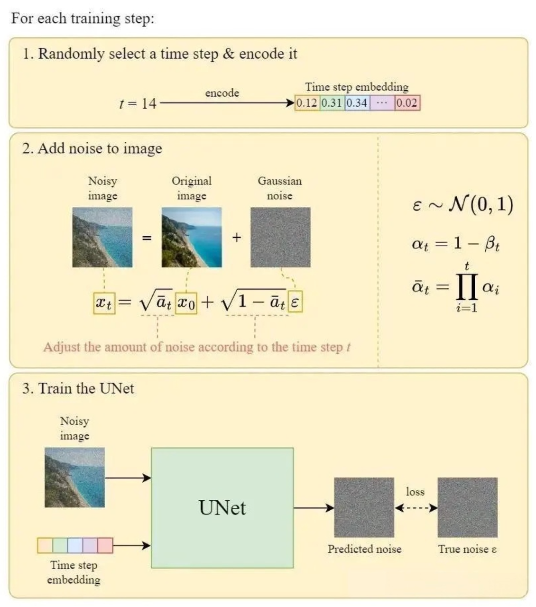

**关于SD模型具体的训练过程，大家可以阅读本文2.3节中了解。**

### **【4】引入Latent思想让SD模型彻底“破圈”**

如果说前面讲到的扩散模型相关基础知识是为SD模型打下地基的话， **引入Latent思想则让SD模型“一遇风雨便化龙”，成为了AIGC时代的图像生成式模型的佼佼者** 。

那么Latent又是什么呢？为了Latent有如此魔力呢？

首先，我们已经知道了扩散模型会设置一个迭代次数，并不会像GAN网络那样一次输入一次输出，虽然这样输出效果会更好更稳定，但是会导致生成过程耗时的增加。

再者，Stable Diffusion出现之前的Diffusion模型虽然已经有非常强的生成能力与生成泛化性能， **但缺点是不管是前向扩散过程还是反向扩散过程，都需要在完整像素级的图像上进行，当图像分辨率和Timesteps很大时，不管是训练还是前向推理，都非常的耗时** 。

**而基于Latent的扩散模型可以将这些过程压缩在低维的Latent隐空间，** 这样一来 **大大降低了显存占用和计算复杂性** ，这是常规扩散模型和基于Latent的扩散模型之间的主要区别， **也是SD模型火爆出圈的关键一招** 。

我们举个形象的例子理解一下，如果SD模型将输入数据压缩的倍数设为8，那么原本尺寸为 [3,512,512] [3, 512, 512] 的数据就会进入 [3,64,64] [3, 64, 64] 的Latent隐空间中， **显存和计算量直接缩小64倍，整体效率大大提升** 。也正是因为这样， **SD模型能够在2080Ti级别的显卡上进行AI绘画，大大推动了SD模型的普惠与生态的繁荣** 。

到这里，大家应该对SD模型的核心基础原理有一个清晰的认识了， **油炸PPT老师这里再帮大家总结一下：**

1. **SD模型是生成式模型** ，输入可以是图片，文本以及两者的结合，输出是生成的图片。
2. **SD模型属于扩散模型** ，扩散模型的整体逻辑的特点是过程分步化与可迭代，这给整个生成过程引入更多约束与优化提供了可能。
3. **SD模型是基于Latent的扩散模型** ，将输入数据压缩到Latent隐空间中，比起常规扩散模型，大幅提高计算效率的同时，降低了显存占用，成为了SD模型破圈的关键一招。
4. **站在CTO视角，将维度拉到最高维，油炸PPT老师认为SD模型是一个优化噪声的AI艺术工具。**

## **2.3** 零基础读懂Stable Diffusion训练全过程（包含详细图解）

**Stable Diffusion的整个训练过程在最高维度上可以看成是如何加噪声和如何去噪声的过程，并在针对噪声的“对抗与攻防”中学习到生成图片的能力。**

Stable Diffusion整体的训练逻辑也非常清晰：

1. 从数据集中随机选择一个训练样本
2. 从K个噪声量级随机抽样一个timestep t t
3. 将timestep t t 对应的高斯噪声添加到图片中
4. 将加噪图片输入U-Net中预测噪声
5. 计算真实噪声和预测噪声的L2损失
6. 计算梯度并更新SD模型参数

下图是SD训练过程Epoch迭代的图解：


下图是SD每个训练step的详细图解过程：


SD每个训练step的详细图解过程

下面油炸PPT老师再对SD模型训练过程中的一些关键环节进行详细的讲解。

### **【1】SD训练集加入噪声**

SD模型训练时，我们需要把加噪的数据集输入模型中，每一次迭代我们用random函数生成从强到弱各个强度的噪声，通常来说会生成0-1000一共1001种不同的噪声强度，通过Time Embedding嵌入到SD的训练过程中。

**Time Embedding由Timesteps（时间步长）编码而来，引入Timesteps能够模拟一个随时间逐渐向图像加入噪声扰动的过程** 。每个Timestep代表一个噪声强度 **（较小的Timestep代表较弱的噪声扰动，而较大的Timestep代表较强的噪声扰动）** ，通过多次增加噪声来逐渐改变干净图像的特征分布。

下图是一个简单的加噪声流程，可以帮助大家更好地理解SD训练时数据是如何加噪声的。首先从数据集中选择一张干净样本，然后再用random函数生成0-3一共4种强度的噪声，然后每次迭代中随机一种强度的噪声，增加到干净图片上，完成图片的加噪流程。


SD训练集的加噪声流程

### **【2】SD训练中加噪与去噪**

具体地，在训练过程中，我们首先对干净样本进行加噪处理，采用多次逐步增加噪声的方式，直至干净样本转变成为纯噪声。

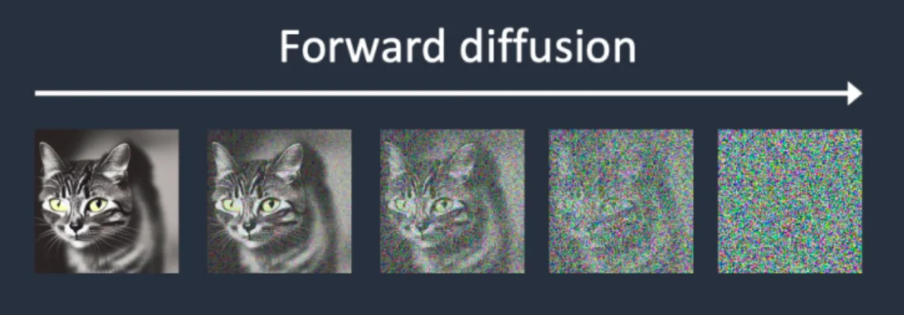

SD训练时的加噪过程

接着，让SD模型学习去噪过程，最后抽象出一个高维函数，这个函数能在纯噪声中不断“优化”噪声，得到一个干净样本。

其中，将去噪过程具像化，就得到使用U-Net预测噪声，并结合Schedule算法逐步去噪的过程。


SD训练时的去噪过程

我们可以看到，加噪和去噪过程都是逐步进行的，我们假设进行 K K 步，那么每一步，SD都要去预测噪声，从而形成“小步快跑的稳定去噪”，类似于移动互联网时代的产品逻辑，这是足够伟大的关键一招。

与此同时，在加噪过程中，每次增加的噪声量级可以不同，假设有5种噪声量级，那么每次都可以取一种量级的噪声，增加噪声的多样性。

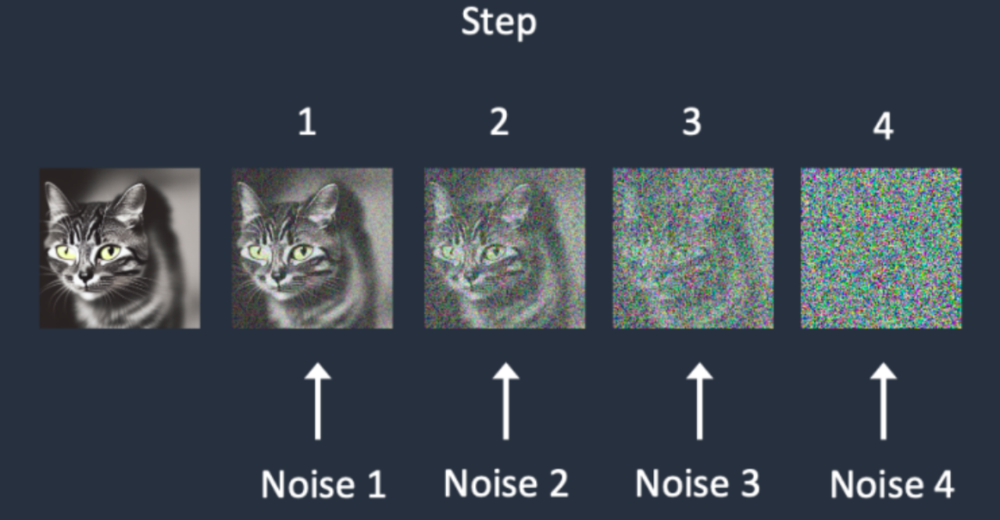

多量级噪声

那么怎么让网络知道目前处于 K K 的哪一步呢？本来SD模型其实需要K个噪声预测模型，这时我们可以增加一个 **Time Embedding** （类似Positional embeddings）进行处理，通过将timestep编码进网络中，从而只需要训练一个共享的U-Net模型，就让网络知道现在处于哪一步。

我们希望SD中的U-Net模型在刚开始的反向扩散过程中可以先生成一些物体的大体轮廓，随着反向扩散过程的深入，在即将完成完整图像的生成时，再生成一些高频的特征信息。

我们了解了训练中的加噪和去噪过程，SD训练的具体过程就是对每个加噪和去噪过程进行计算，从而优化SD模型参数，如下图所示分为四个步骤：从训练集中选取一张加噪过的图片和噪声强度（timestep），然后将其输入到U-Net中，让U-Net预测噪声（下图中的Unet Prediction），接着再计算预测噪声与真实噪声的误差（loss），最后通过反向传播更新U-Net的参数。

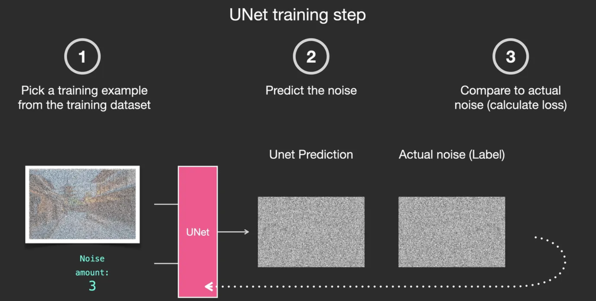

完成U-Net的训练，我们就可以用U-Net对噪声图片进行去噪，逐步重建出有效图像的Latent Feature了！

在噪声图上逐步减去被U-Net预测出来的噪声，从而得到一个我们想要的高质量的图像隐特征，去噪流程如下图所示：


### **【3】语义信息对图片生成的控制**

SD模型在生成图片时，需要输入prompt，那么这些语义信息是如何影响图片的生成呢？

**答案非常简单：注意力机制。**

在SD模型的训练中，每个训练样本都会对应一个标签，我们将对应标签通过CLIP Text Encoder输出Text Embeddings，并将Text Embeddings以 **Cross Attention** 的形式与U-Net结构耦合，使得每次输入的图片信息与文字信息进行融合训练，如下图所示：


Noise与Text Embeddings通过CrossAttention与U-Net结构耦合

上图中的 **token** 是NLP领域的一个基础概念，可以理解为最小语意单元。与之对应的分词操作为tokenization。油炸PPT老师举一个简单的例子来帮助大家理解：“WeThinkIn是伟大的自媒体”是一个句子，我们需要将其切分成一个token序列，这个操作就是 **tokenization** 。经过tokenization操作后，我们获得["WeThinkIn", "是", "伟大的", "自媒体"]这个句子的token序列，从而完成对文本信息的预处理。

### **【4】SD模型训练时的输入**

有了上面的介绍， **我们在这里可以小结一下SD模型训练时的输入，一共有三个部分组成：图片，文本，噪声强度** 。其中图片和文本是固定的，而噪声强度在每一次训练参数更新时都会随机选择一个进行叠加。


SD模型训练时需要的数据配置

## 2.4 其他主流生成式模型介绍

在AIGC时代中，虽然SD模型已经成为核心的生成式模型之一， **但是曾在传统深度学习时代火爆的GAN，VAE，Flow-based model等模型也跨过周期在SD模型身边作为辅助，发挥了巨大的作用** 。

下面是主流生成式模型各自的生成逻辑：


生成式模型的主流架构

**GAN网络在AIGC时代依然发挥了巨大的作用，配合SD模型完成了很多算法工作流，比如：图像超分、脸部修复、风格迁移、图像编辑、图像fix、图像定权等。**

所以油炸PPT老师在这里简单讲解一下GAN的基本原理，让大家做个了解。GAN由生成器 G G 和判别器 D D 组成。其中，生成器主要负责生成相应的样本数据，输入一般是由高斯分布随机采样得到的噪声 Z Z 。而判别器的主要职责是区分生成器生成的样本与 gt（GroundTruth） gt（GroundTruth） 样本，输入一般是 gt gt 样本与相应的生成样本，我们想要的是对 gt gt 样本输出的置信度越接近 1 1 越好，而对生成样本输出的置信度越接近 0 0 越好。与一般神经网络不同的是， **GAN在训练时要同时训练生成器与判别器，所以其训练难度是比较大的** 。

我们可以将GAN中的生成器比喻为印假钞票的犯罪分子，判别器则被当作警察。犯罪分子努力让印出的假钞看起来逼真，警察则不断提升对于假钞的辨识能力。二者互相博弈，随着时间的进行，都会越来越强。在图像生成任务中也是如此，生成器不断生成尽可能逼真的假图像。判别器则判断图像是 gt gt 图像，还是生成的图像。 **二者不断博弈优化** ，最终生成器生成的图像使得判别器完全无法判别真假。

关于Flow-based models，其在AIGC时代的作用还未显现，可以持续关注。

最后， **VAE将在本文后面的章节详细讲解，因为正是VAE将输入数据压缩至Latent隐空间中，故其成为了SD模型的核心结构之一。**

# 3. Stable Diffusion核心网络结构解析（全网最详细）

## **3.1 SD模型整体架构初识**

**Stable Diffusion模型整体上是一个End-to-End模型** ，主要由VAE（变分自编码器，Variational Auto-Encoder），U-Net以及CLIP Text Encoder三个核心组件构成。

在FP16精度下Stable Diffusion模型大小2G（FP32：4G），其中U-Net大小1.6G，VAE模型大小160M以及CLIP Text Encoder模型大小235M（约123M参数）。其中U-Net结构包含约860M参数，以FP32精度下大小为3.4G左右。

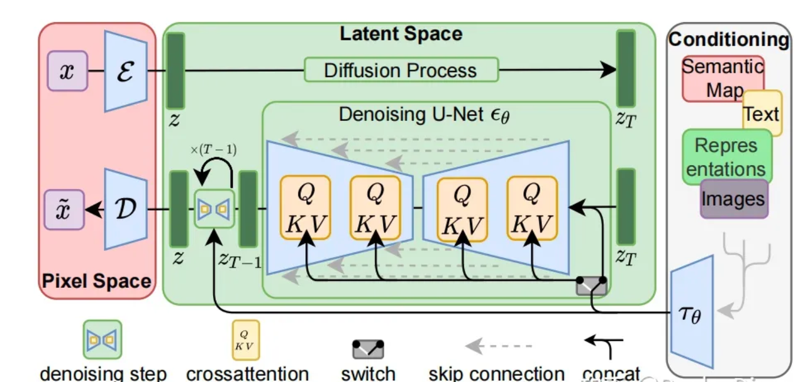

Stable Diffusion整体架构图

## 3.2 VAE模型

在Stable Diffusion中， **VAE（变分自编码器，Variational Auto-Encoder）是基于Encoder-Decoder架构的生成模型** 。VAE的Encoder（编码器）结构能将输入图像转换为低维Latent特征，并作为U-Net的输入。VAE的Decoder（解码器）结构能将低维Latent特征重建还原成像素级图像。

### **【1】Stable Diffusion中VAE的核心作用**

总的来说， **在Stable Diffusion中，VAE模型主要起到了图像压缩和图像重建的作用** ，如下图所示：


VAE在Stable Diffusion中的主要功能

当我们输入一个尺寸为 H×W×C H\times W \times C 的数据，VAE的Encoder模块会将其编码为一个大小为 h×w×c h\times w \times c 的低维Latent特征，其中 f=H/h=W/w f=H/h=W/w 为VAE的 **下采样率（Downsampling Factor）** 。反之，VAE的Decoder模块有一个相同的 **上采样率（Upsampling Factor）** 将低维Latent特征重建成像素级别的图像。

**为什么VAE可以将图像压缩到一个非常小的Latent space（潜空间）后能再次对图像进行像素级重建呢？**

因为虽然VAE对图像的压缩与重建过程是一个有损压缩与重建过程，但 **图像全图级特征关联并不是随机的，它们的分布具有很强的规律性** ：比如人脸的眼睛、鼻子、脸颊和嘴巴之间遵循特定的空间关系，又比如一只猫有四条腿，并且这是一个特定的生物结构特征。下面油炸PPT老师也使用VAE将图像重建成不同尺寸的生成图像，实验结论发现 **如果我们重建生成的图像尺寸在 512×512 512 \times 512 之上时，其实特征损失带来的影响非常小** 。

### **【2】Stable Diffusion中VAE的高阶作用**

与此同时，VAE模型除了能进行图像压缩和图像重建的工作外， **如果我们在SD系列模型中切换不同微调训练版本的VAE模型，能够发现生成图片的细节与整体颜色也会随之改变（更改生成图像的颜色表现，类似于色彩滤镜）。**

**目前在开源社区常用的VAE模型有：** vae-ft-mse-840000-ema-pruned.ckpt、kl-f8-anime.ckpt、kl-f8-anime2.ckpt、 YOZORA.vae.pt 、 orangemix.vae.pt 、 blessed2.vae.pt 、 animevae.pt 、ClearVAE.safetensors、 pastel-waifu-diffusion.vae.pt 、cute_vae.safetensors、 color101VAE_v1.pt 等。

这里油炸PPT老师使用了10种不同的VAE模型，在其他参数保持不变的情况下，对比了SD模型的出图效果，如下所示：

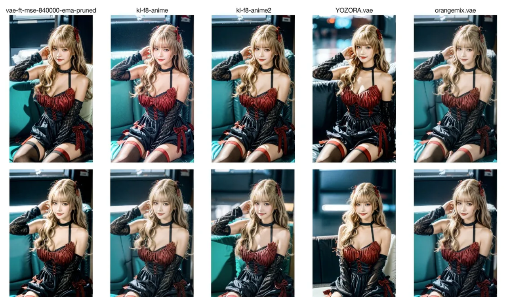

Stable Diffusion中10种不同VAE模型的效果对比

可以看到， **我们在切换VAE模型进行出图时，除了pastel-waifu-diffusion.vae.pt模型外，其余VAE模型均不会对构图进行大幅改变，只对生成图像的细节与颜色表现进行调整** 。

油炸PPT老师目前也在整理汇总高价值的VAE模型（持续更新！），方便大家获取使用。大家可以关注油炸PPT老师的公众号 **WeThinkIn** ，后台回复： **SDVAE** ，即可获得资源链接，包含 **上述的全部VAE模型权重和更多高价值VAE模型权重** 。

### **【3】Stable Diffusion中VAE模型的完整结构图（全网最详细）**

下图是油炸PPT老师梳理的 **Stable Diffusion VAE的完整结构图** ，大家可以感受一下其魅力，看着这个完整结构图学习Stable Diffusion VAE模型部分，相信大家脑海中的思路也会更加清晰：

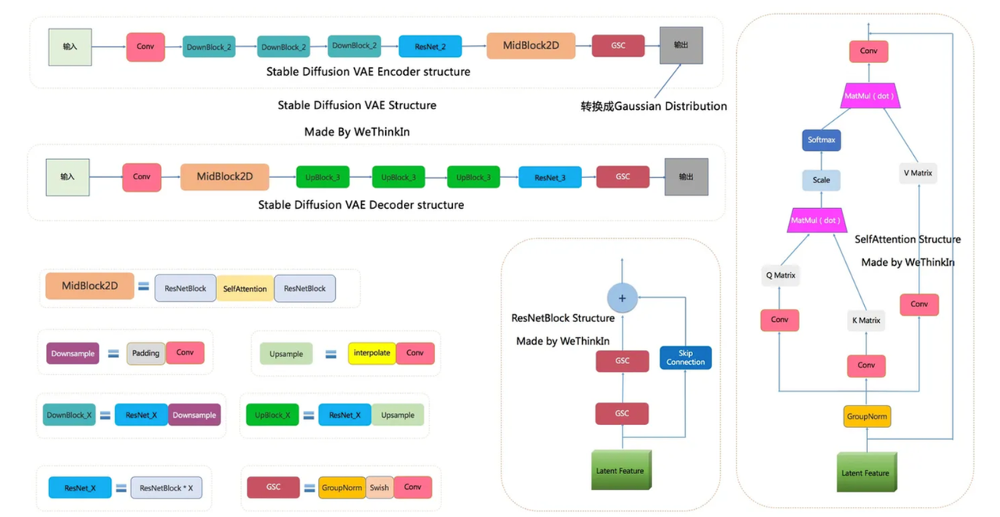

Stable Diffusion VAE完整结构图

SD VAE模型中有三个基础组件：

1. GSC组件：GroupNorm+Swish+Conv
2. Downsample组件：Padding+Conv
3. Upsample组件：Interpolate+Conv

同时SD VAE模型还有两个核心组件：ResNetBlock模块和SelfAttention模型，两个模块的结构如上图所示。

SD VAE Encoder部分包含了三个DownBlock模块、一个ResNetBlock模块以及一个MidBlock模块，将输入图像压缩到Latent空间，转换成为Gaussian Distribution。

而VAE Decoder部分正好相反，其输入Latent空间特征，并重建成为像素级图像作为输出。其包含了三个UpBlock模块、一个ResNetBlock模块以及一个MidBlock模块。

### **【4】Stable Diffusion中VAE的训练过程与损失函数**

在Stable Diffusion中，需要对VAE模型进行微调训练，主要采用了 **L1回归损失和感知损失** （perceptual loss，Learned Perceptual Image Patch Similarity，LPIPS）作为损失函数，同时使用了 **基于patch的对抗训练策略** 。

**L1回归损失** 作为传统深度学习时代的经典回归损失，用在回归问题中衡量预测值与真实值之间的差异，在生成模型中很常用，其公式如下所示： L1(y, \hat`y`) = \sum_{i=1}^`n` |y_i - \hat`y`_i| \\ 其中， y_i 是输入数据的真实值， \hat`y`_i 是模型生成数据的预测值， n 是数据总数。

**感知损失** 同样作为传统深度学习时代的经典回归损失，在AIGC时代继续繁荣。 **感知损失的核心思想是比较原始图像和生成图像在传统深度学习模型（VGG、ResNet、ViT等）不同层中特征图之间的相似度，而不直接进行像素级别的对比** 。

传统深度学习模型能够提取图像的高维语义信息的特征， **如果两个图像在高维语义信息的特征上接近，那么它们在像素级别的语意上也应该是相似的** ，感知损失在图像重建、风格迁移等任务中非常有效。

感知损失的公式如下所示：

L_`perceptual` = \sum_`l` \lambda_l \cdot || \phi_l(I_`pred`) - \phi_l(I_`target`) ||_2^2 \\

其中：

- \phi_l 表示在预训练模型（比如VGG/ResNet网络）的第 l 层的激活特征。
- I_`pred` 是模型生成的图像。
- I_`target` 是真实图像。
- \lambda_l 是第 l 层的权重，可以根据实际情况设置合适值。

最后就是 **基于patch的对抗训练策略** ，我们使用PatchGAN的 **判别器** 来对VAE模型进行对抗训练，通过优化 **判别器损失** ， **来提升生成图像的局部真实性（纹理和细节）与清晰度** 。

PatchGAN是GAN系列模型的一个变体， **其判别器架构不再评估整个生成图像是否真实，而是评估生成图像中的patch部分是否真实** 。具体来说，PatchGAN的判别器接收一张图像，并输出一个矩阵，矩阵中的每个元素代表图像中对应区域的真实性。这种方法能够专注于优化生成图像的局部特征，生成更细腻、更富有表现力的纹理，同时计算负担相对较小。特别适合于那些细节和纹理特别重要的任务，例如图像超分辨率、风格迁移或图生图等任务。

到这里， **油炸PPT老师已经帮大家分析好Stable Diffusion中VAE训练的三大主要损失函数：** L1回归损失、感知损失以及PachGAN的判别器损失。

与此同时， **为了防止在Latent空间的任意缩放导致的标准差过大** ，在训练VAE模型的过程中引入了 **正则化损失** ，主要包括KL（Kullback-Leibler）正则化与VQ（Vector Quantization）正则化。 **KL正则化** 主要是让Latnet特征不要偏离正态分布太远，同时设置了较小的权重（～10e-6）来保证VAE的重建效果。 **VQ正则化** 通过在decoder模块中引入一个VQ-layer，将VAE转换成VQ-GAN，同样为了保证VAE的重建效果，设置较高的codebook采样维度（8192）。

Stable Diffusion论文中实验了不同参数下的VAE模型性能表现，具体如下图所示。 **当 f 较小和 c 较大时，重建效果较好（PSNR值较大）** ，因为此时图像的压缩率较小。但是VAE模型在ImageNet数据集上训练时发现 **设置过小的 f （比如1和2）会导致VAE模型收敛速度慢** ，SD模型需要更长的训练周期。如果 **设置过大的 f 会导致VAE模型的生成质量较差，因为此时压缩损失过大** 。论文中实验发现，当设置 f 在4～16的区间时，VAE模型可以取得相对好的生成效果。

通过综合评估正则化损失项、 f 项以及 c 项， **最终Stable Diffusion中的VAE模型选择了KL正则化进行优化训练，同时设置下采样率 f=8 ，设置特征维度为 c=4 。** 此时当输入图像尺寸为768x768时，将得到尺寸为96x96x4的Latent特征。


不同参数下的VAE模型性能表现

讲到这里，终于可以给大家展示Stable DIffusion中VAE模型的完整损失函数了，下面是Stable Diffusion中VAE训练的完整损失函数：

虽然VAE模型使用了KL正则化，但是由于KL正则化的权重系数非常小，实际生成的Latent特征的标准差依旧存在比较大的情况，所以Stable Diffusion论文中提出了一种 **rescaling方法强化正则效果** 。首先我们计算第一个batch数据中Latent特征的标准差 \sigma ，然后采用 1/ \sigma 的系数来rescale后续所有的Latent特征使其标准差接近于1。同时在Decoder模块进行重建时，只需要将生成的Latent特征除以 1/\sigma ，再进行像素级重建即可。 **在SD中，U-Net模型使用的是经过rescaling后的Latent特征，并且将rescaling系数设置为0.18215** 。

### **【5】使用Stable Diffusion中VAE对图像的压缩与重建效果示例**

在本小节中，油炸PPT老师将用diffusers库来快速加载Stable Diffusion 1.5中的VAE模型，并通过可视化的效果直观展示VAE的压缩与重建效果，完整代码如下所示：

```
import cv2
import torch
import numpy as np
from diffusers import AutoencoderKL

# 加载VAE模型: VAE模型可以通过指定subfolder文件来单独加载。
# SD V1.5模型权重百度云网盘：关注油炸PPT老师的公众号WeThinkIn，后台回复：SD模型，即可获得资源链接
VAE = AutoencoderKL.from_pretrained("/本地路径/stable-diffusion-v1-5", subfolder="vae")
VAE.to("cuda", dtype=torch.float16)

# 用OpenCV读取和调整图像大小
raw_image = cv2.imread("catwoman.png")
raw_image = cv2.cvtColor(raw_image, cv2.COLOR_BGR2RGB)
raw_image = cv2.resize(raw_image, (1024, 1024))

# 将图像数据转换为浮点数并归一化
image = raw_image.astype(np.float32) / 127.5 - 1.0

# 调整数组维度以匹配PyTorch的格式 (N, C, H, W)
image = image.transpose(2, 0, 1)
image = image[None, :, :, :]

# 转换为PyTorch张量
image = torch.from_numpy(image).to("cuda", dtype=torch.float16)

# 压缩图像为Latent特征并重建
with torch.inference_mode():
    # 使用VAE进行压缩和重建
    latent = VAE.encode(image).latent_dist.sample()
    rec_image = VAE.decode(latent).sample

    # 后处理
    rec_image = (rec_image / 2 + 0.5).clamp(0, 1)
    rec_image = rec_image.cpu().permute(0, 2, 3, 1).numpy()

    # 反归一化
    rec_image = (rec_image * 255).round().astype("uint8")
    rec_image = rec_image[0]

    # 保存重建后图像
    cv2.imwrite("reconstructed_catwoman.png", cv2.cvtColor(rec_image, cv2.COLOR_RGB2BGR))

```

接下来，我们分别使用1024x1024分辨率的真实场景图片和1024x1536分辨率的二次元图片，使用SD 1.5 VAE模型进行四种尺寸下的压缩与重建，重建效果如下所示：


SD 1.5 VAE模型对真实场景图片和二次元图片的压缩与重建效果

可以看到，VAE在对图像进行压缩和重建时，是存在精度损失的，比如256x256分辨率和256x768分辨率下重建，会出现人脸崩坏的情况。同时我们可以看到， **二次元图片比起真实场景图片更加鲁棒，在不同尺寸下重建时，二次元图片的主要特征更容易保留下来，局部特征畸变的情况较少，损失程度较低** 。

为了避免压缩与重建的损失影响Stable Diffusion生成图片的质量， **我们可以在微调训练、文生图、图生图等场景中进行如下设置：**

- 文生图场景：生成图像尺寸尽量在512x512以上。
- 图生图场景：对输出图像进行缩放生成时，生成图像尺寸尽量在512x512以上。
- 微调训练：训练数据集尺寸尽量在512x512以上。

同时， **StabilityAI官方也对VAE模型进行了优化，** 首先发布了 **基于模型指数滑动平均（EMA）技术微调的 vae-ft-ema-560000-ema-pruned 版本** ，训练集使用了LAION两个1:1比例数据子集，目的是增强VAE模型对扩散模型数据集的适应性，同时改善脸部的重建效果。在此基础上， **使用MSE损失继续微调优化并发布了vae-ft-mse-840000-ema-pruned版本，这个版本的重建效果更佳平滑自然。** 两个优化版本都只优化了VAE的Decoder部分，由于SD在微调训练中只需要Encoder部分提供Latent特征，所以优化训练后的VAE模型可以与开源社区的所有SD模型都兼容。

### 【6】 **DaLL-E 3同款解码器consistency-decoder**

OpenAI开源的 **一致性解码器（consistency-decoder），** 能生成质量更高的图像内容、更稳定的图像构图，比如在多人脸、带文字图像以及线条控制方面有更好的效果。consistency-decoder既能用于DaLL-E 3模型，同时也支持作为Stable Diffusion 1.x和2.x的VAE模型。

下图是将原生SD VAE模型与consistency-decoder模型在 **256x256分辨率下的图像重建效果对比** ，可以看到在小分辨率情况下，consistency-decoder模型确实有更好的重建效果：

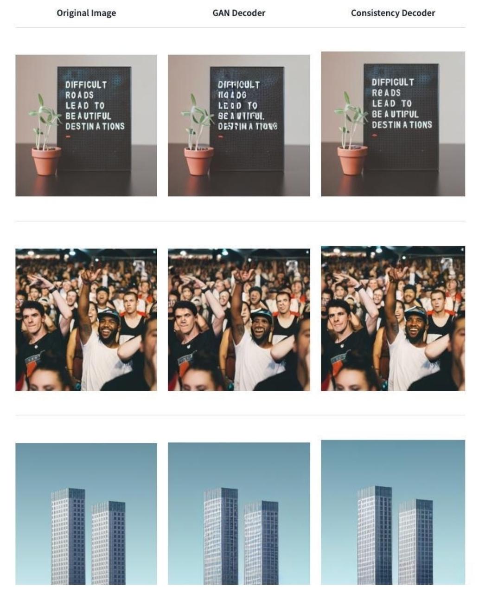

原生SD VAE与consistency-decoder在256x256分辨率下的重建效果对比

我们用diffusers库可以快速加载consistency-decoder模型使用，完整代码如下所示：

```
import torch
from diffusers import DiffusionPipeline, ConsistencyDecoderVAE

# SD 1.5和consistency-decoder模型权重百度云网盘：关注油炸PPT老师的公众号WeThinkIn，后台回复：SD模型，即可获得资源链接
vae = ConsistencyDecoderVAE.from_pretrained("/本地路径/consistency-decoder", torch_dtype=pipe.torch_dtype)
pipe = StableDiffusionPipeline.from_pretrained(
    "/本地路径/stable-diffusion-v1-5", vae=vae, torch_dtype=torch.float16
).to("cuda")

pipe("horse", generator=torch.manual_seed(0)).images

```

但是由于consistency-decoder模型较大（FP32：2.49G，FP16：1.2G），重建耗时会比原生的SD VAE模型大得多，并且在高分辨率（比如1024x1024）下效果并没有明显高于原生的SD VAE模型，所以最好将consistency-decoder模型作为补充储备模型之用。

## **3.3 U-Net模型**

### **【1】Stable Diffusion中U-Net的核心作用**

在Stable Diffusion中， **U-Net模型是一个关键核心部分，能够预测噪声残差** ，并结合Sampling method（调度算法：PNDM，DDIM，K-LMS等）对输入的特征矩阵进行重构， **逐步将其从随机高斯噪声转化成图片的Latent Feature** 。

具体来说，在前向推理过程中，SD模型通过反复调用 U-Net，将预测出的噪声残差从原噪声矩阵中去除，得到逐步去噪后的图像Latent Feature，再通过VAE的Decoder结构将Latent Feature重建成像素级图像，如下图所示：


**油炸PPT老师再从AI绘画应用视角解释一下SD中U-Net的原理与作用。** 其实大家在使用Stable Diffusion WebUI时，点击Generate按钮后，页面右下角图片生成框中展示的从噪声到图片的生成过程，其中就是U-Net在不断的为大家去除噪声的过程。到这里大家应该都能比较清楚的理解U-Net的作用了。

### **【2】Stable Diffusion中U-Net模型的完整结构图（全网最详细）**

好了，我们再回到AIGC算法工程师视角。

Stable Diffusion中的U-Net，在传统深度学习时代的Encoder-Decoder结构的基础上， **增加了ResNetBlock（包含Time Embedding）模块，Spatial Transformer（SelfAttention + CrossAttention + FeedForward）模块以及CrossAttnDownBlock，CrossAttnUpBlock和CrossAttnMidBlock模块** 。

**那么各个模块都有什么作用呢？不着急，咱们先看看SD U-Net的整体架构（AIGC算法工程师面试核心考点）。**

下图是油炸PPT老师梳理的 **Stable Diffusion U-Net的完整结构图** ，大家可以感受一下其魅力，看着这个完整结构图学习Stable Diffusion U-Net部分，相信大家脑海中的思路也会更加清晰：

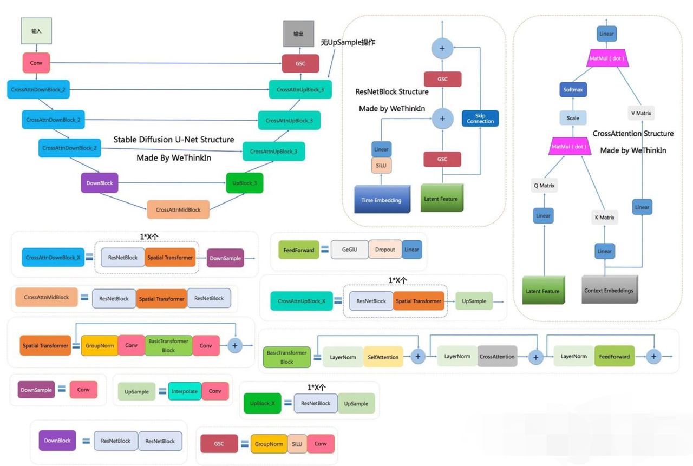

Stable Diffusion U-Net完整结构图

**上图中包含Stable Diffusion U-Net的十四个基本模块：**

```
1. **GSC模块：** Stable Diffusion U-Net中的最小组件之一，由GroupNorm+SiLU+Conv三者组成。
2. **DownSample模块：** Stable Diffusion U-Net中的下采样组件， **使用了Conv（kernel_size=(3, 3), stride=(2, 2), padding=(1, 1)）进行采下采样** 。
3. **UpSample模块：** Stable Diffusion U-Net中的上采样组件，由 **插值算法（nearest）** +Conv组成。
4. **ResNetBlock模块：** 借鉴ResNet模型的“残差结构”， **让网络能够构建的更深的同时，将Time Embedding信息嵌入模型** 。
5. **CrossAttention模块：** 将文本的语义信息与图像的语义信息进行Attention机制，增强输入文本Prompt对生成图片的控制。
6. **SelfAttention模块：** SelfAttention模块的整体结构与CrossAttention模块相同，这是输入全部都是图像信息，不再输入文本信息。
7. **FeedForward模块：** Attention机制中的经典模块，由GeGlU+Dropout+Linear组成。
8. **BasicTransformer Block模块：** 由LayerNorm+SelfAttention+CrossAttention+FeedForward组成，是多重Attention机制的级联，并且也借鉴ResNet模型的“残差结构”。 **通过加深网络和多Attention机制，大幅增强模型的学习能力与图文的匹配能力** 。
9. **Spatial Transformer模块：** 由GroupNorm+Conv+BasicTransformer Block+Conv构成，ResNet模型的“残差结构”依旧没有缺席。
10. **DownBlock模块：** 由两个ResNetBlock模块组成。
11. **UpBlock_X模块：** 由X个ResNetBlock模块和一个UpSample模块组成。
12. **CrossAttnDownBlock_X模块：** 是Stable Diffusion U-Net中Encoder部分的主要模块，由X个（ResNetBlock模块+Spatial Transformer模块）+DownSample模块组成。
13. **CrossAttnUpBlock_X模块：** 是Stable Diffusion U-Net中Decoder部分的主要模块，由X个（ResNetBlock模块+Spatial Transformer模块）+UpSample模块组成。
14. **CrossAttnMidBlock模块：** 是Stable Diffusion U-Net中Encoder和ecoder连接的部分，由ResNetBlock+Spatial Transformer+ResNetBlock组成。
```
接下来，油炸PPT老师将为大家全面分析SD模型中U-Net结构的核心知识， **码字实在不易，希望大家能多多点赞，谢谢！**

**（1）ResNetBlock模块**

在传统深度学习时代，ResNet的残差结构在图像分类，图像分割，目标检测等主流方向中几乎是不可或缺， **其简洁稳定有效的“残差思想”终于在AIGC时代跨过周期，在SD模型的U-Net结构中继续繁荣** 。

值得注意的是， **Time Embedding正是输入到ResNetBlock模块中，为U-Net引入了时间信息（时间步长T，T的大小代表了噪声扰动的强度），模拟一个随时间变化不断增加不同强度噪声扰动的过程，让SD模型能够更好地理解时间相关性** 。

同时，在SD模型调用U-Net重复迭代去噪的过程中，我们希望在迭代的早期，能够先生成整幅图片的轮廓与边缘特征，随着迭代的深入，再补充生成图片的高频和细节特征信息。 **由于在每个ResNetBlock模块中都有Time Embedding，就能告诉U-Net现在是整个迭代过程的哪一步，并及时控制U-Net够根据不同的输入特征和迭代阶段而预测不同的噪声残差** 。

**油炸PPT老师再从AI绘画应用视角解释一下Time Embedding的作用。** Time Embedding能够让SD模型在生成图片时考虑时间的影响，使得生成的图片更具有故事性、情感和沉浸感等艺术效果。并且Time Embedding可以帮助SD模型在不同的时间点将生成的图片添加完善不同情感和主题的内容，从而增加了AI绘画的多样性和表现力。

定义Time Embedding的代码如下所示，可以看到Time Embedding的生成方式，主要通过sin和cos函数再经过Linear层进行变换。：

```
def time_step_embedding(self, time_steps: torch.Tensor, max_period: int = 10000):
    half = self.channels // 2
    frequencies = torch.exp(
            -math.log(max_period) * torch.arange(start=0, end=half, dtype=torch.float32) / half
        ).to(device=time_steps.device)
    args = time_steps[:, None].float() * frequencies[None]
    return torch.cat([torch.cos(args), torch.sin(args)], dim=-1)

```

讲完Time Embedding的相关核心知识，我们再学习一下ResNetBlock模块的整体知识。

在上面的Stable Diffusion U-Net完整结构图中展示了完整的ResNetBlock模块，其输入包括Latent Feature和 Time Embedding。首先Latent Feature经过GSC（GroupNorm+SiLU激活函数+卷积）模块后和Time Embedding（经过SiLU激活函数+全连接层处理）做 **加和操作** ，之后再经过GSC模块和Skip Connection而来的输入Latent Feature做 **加和操作** ，进行 **两次特征融合** 后最终得到ResNetBlock模块的Latent Feature输出， **增强SD模型的特征学习能力** 。

同时，和传统深度学习时代的U-Net结构一样，Decoder结构中的ResNetBlock模块不单单要接受来自上一层的Latent Feature，还要与Encoder结构中对应层的ResNetBlock模块的输出Latent Feature进行 **concat操作** 。举个例子，如果Decoder结构中ResNetBlock Structure上一层的输出结果的尺寸为 [512, 512, 1024]，Encoder结构对应 ResNetBlock Structure的输出结果的尺寸为 [512, 512, 2048]，那么这个Decoder结构中ResNeBlock Structure得到的Latent Feature的尺寸为 [512, 512, 3072]。

**（2）CrossAttention模块**

**CrossAttention模块是我们使用输入文本Prompt控制SD模型图片内容生成的关键一招。**

上面的Stable Diffusion U-Net完整结构图中展示了Spatial Transformer(Cross Attention)模块的结构。Spatial Transformer模块和ResNetBlock模块一样接受 **两个输入** ：一个是ResNetBlock模块的输出，另外一个是输入文本Prompt经过CLIP Text Encoder模型编码后的Context Embedding。

两个输入首先经过Attention机制（ **将Context Embedding对应的语义信息与图片中对应的语义信息相耦合** ），输出新的Latent Feature，再将新输出的Latent Feature与输入的Context Embedding再做一次Attention机制， **从而使得SD模型学习到了文本与图片之间的特征对应关系** 。

**Spatial Transformer模块不改变输入输出的尺寸，只在图片对应的位置上融合了语义信息，所以不管是在传统深度学习时代，还是AIGC时代，Spatial Transformer都是将本文与图像结合的一个“万金油”模块** 。

看CrossAttention模块的结构图，大家可能会疑惑 **为什么Context Embedding用来生成K和V，Latent Feature用来生成Q呢？**

原因也非常简单：因为在Stable Diffusion中，主要的目的是想把文本信息注入到图像信息中里，所以用图片token对文本信息做 Attention实现逐步的文本特征提取和耦合。

**油炸PPT老师再从AI绘画应用视角解释一下CrossAttention模块的作用。** CrossAttention模块在AI绘画应用中可以被视为一种连接和表达的工具，它有助于在输入文本和生成图片之间建立联系，创造更具深度和多样性的艺术作品，引发观众的思考和情感共鸣。CrossAttention模块可以将图像和文本信息关联起来，就像艺术家可以将不同的元素融合到一幅作品中，这有助于在创作中实现不同信息之间的协同和互动，产生更具创意性的艺术作品。再者CrossAttention模块可以用于将文本中的情感元素传递到生成图片中，这种情感的交互可以增强艺术作品的表现力和观众的情感共鸣。

**（3）BasicTransformer Block模块**

BasicTransformer Block模块是在CrossAttention子模块的基础上，增加了SelfAttention子模块和Feedforward子模块共同组成的， **并且每个子模块都是一个残差结构** ，这样 **除了能让文本的语义信息与图像的语义信息更好的融合之外，还能通过SelfAttention机制让模型更好的学习图像数据的特征** 。

写到这里，可能还有读者会问， **Stable Diffusion U-Net中的SelfAttention到底起了什么作用呀?**

首先，在Stable Diffusion U-Net的SelfAttention模块中， **输入只有图像信息，所以SelfAttention主要是为了让SD模型更好的学习图像数据的整体特征** 。

再者， **SelfAttention可以将输入图像的不同部分（像素或图像Patch）进行交互，从而实现特征的整合和全局上下文的引入，能够让模型建立捕捉图像全局关系的能力，有助于模型理解不同位置的像素之间的依赖关系，以更好地理解图像的语义。**

在此基础上， **SelfAttention还能减少平移不变性问题** ，SelfAttention模块可以在不考虑位置的情况下捕捉特征之间的关系，因此具有一定的平移不变性。

**油炸PPT老师再从AI绘画应用视角解释一下SelfAttention的作用。** SelfAttention模块可以让SD模型在图片生成过程中捕捉内在关系、创造性表达情感和思想、突出重要元素，并创造出丰富多彩、具有深度和层次感的艺术作品。

**（4）Spatial Transformer模块**

更进一步的，在BasicTransformer Block模块基础上，加入GroupNorm和两个卷积层就组成Spatial Transformer模块。Spatial Transformer模块是SD U-Net中的核心Base结构，Encoder中的CrossAttnDownBlock模块，Decoder中的CrossAttnUpBlock模块以及CrossAttnMidBlock模块都包含了大量的Spatial Transformer子模块。

**在生成式模型中，GroupNorm的效果一般会比BatchNorm更好** ，生成式模型通常比较复杂，因此需要更稳定和适应性强的归一化方法。

而GroupNorm主要有以下一些优势，让其能够成为生成式模型的标配：

1. **对训练中不同Batch-Size的适应性** ：在生成式模型中，通常需要使用不同的Batch-Size进行训练和微调。这会导致 BatchNorm在训练期间的不稳定性，而GroupNorm不受Batch-Size的影响，因此更适合生成式模型。

2. **能适应通道数变化** ：GroupNorm 是一种基于通道分组的归一化方法，更适应通道数的变化，而不需要大量调整。

3. **更稳定的训练** ：生成式模型的训练通常更具挑战性，存在训练不稳定性的问题。GroupNorm可以减轻训练过程中的梯度问题，有助于更稳定的收敛。

4. **能适应不同数据分布** ：生成式模型通常需要处理多模态数据分布，GroupNorm 能够更好地适应不同的数据分布，因为它不像 Batch Normalization那样依赖于整个批量的统计信息。

**（5）CrossAttnDownBlock/CrossAttnUpBlock/CrossAttnMidBlock模块**

在Stable Diffusion U-Net的Encoder部分中， **使用了三个CrossAttnDownBlock模块，其由ResNetBlock Structure+BasicTransformer Block+Downsample构成** 。Downsample通过使用一个卷积（kernel_size=(3, 3), stride=(2, 2), padding=(1, 1)）来实现。

在Decoder部分中， **使用了三个CrossAttnUpBlock模块，其由ResNetBlock Structure+BasicTransformer Block+Upsample构成** 。Upsample使用插值算法+卷积来实现，插值算法将输入的Latent Feature尺寸扩大一倍，同时通过一个卷积（kernel_size=(3, 3), stride=(1, 1), padding=(1, 1)）改变Latent Feature的通道数，以便于输入后续的模块中。

在CrossAttnMidBlock模块中， **包含ResNetBlock Structure+BasicTransformer Block+ResNetBlock Structure** ，作为U-Net的Encoder与Decoder之间的媒介。

**（6）Stable Diffusion U-Net整体宏观角度小结**

**从整体上看，不管是在训练过程还是前向推理过程，Stable Diffusion中的U-Net在每次循环迭代中Content Embedding部分始终保持不变，而Time Embedding每次都会发生变化。**

和传统深度学习时代的U-Net一样， **Stable Diffusion中的U-Net也是不限制输入图片的尺寸，因为这是个基于Transformer和卷积的模型结构** 。

### **【3】Stable Diffusion中U-Net的训练过程与损失函数**

在我们进行Stable Diffusion模型训练时，VAE部分和CLIP部分都是冻结的，所以说官方在训练SD系列模型的时候，训练过程一般主要训练U-Net部分。

我们之前我们已经讲过在Stable Diffusion中U-Net主要是进行噪声残差，在SD系列模型训练时和DDPM一样采用预测噪声残差的方法来训练U-Net，其损失函数如下所示：

到这里，Stable Diffusion U-Net的完整核心基础知识就介绍好了，欢迎大家在评论区发表自己的观点，也希望大家能多多点赞，油炸PPT老师会持续完善本文的全部内容，大家敬请期待！

### **【4】SD模型融合详解（Merge Block Weighted，MBW）**

不管是传统深度学习时代，还是AIGC时代，模型融合永远都是学术界、工业界以及竞赛界的一个重要Trick。

在AI绘画领域，很多AI绘画开源社区里都有SD融合模型的身影，这些融合模型往往集成了多个SD模型的优点，同时规避了不足，让这些SD融合模型在开源社区中很受欢迎。

接下来油炸PPT老师将带着大家详细了解SD模型的模型融合过程与方法， **大家可能会好奇为什么SD模型融合会在介绍SD U-Net的章节中讲到，原因是SD的模型融合方法主要作用于U-Net部分** 。

首先，我们需要知道SD模型融合的形式，一共三种有如下所示：

- SD模型 + SD模型 -> 新SD模型
- SD模型 + LoRA模型 -> 新SD模型
- LoRA模型 + LoRA模型 -> 新LoRA模型

## **3.4 CLIP Text Encoder模型**

**作为文生图模型，Stable Diffusion中的文本编码模块直接决定了语义信息的优良程度，从而影响到最后图片生成的多样性和可控性。**

在这里， **多模态领域的神器——CLIP（Contrastive Language-Image Pre-training）** ，跨过了周期，从传统深度学习时代进入AIGC时代，成为了SD系列模型中文本和图像之间的连接通道。 **并且从某种程度上讲，正是因为CLIP模型的前置出现，更加快速地推动了AI绘画领域的繁荣** 。

那么，什么是CLIP呢？CLIP有哪些优良的性质呢？为什么是CLIP呢？

首先， **CLIP模型是一个基于对比学习的多模态模型，主要包含Text Encoder和Image Encoder两个模型** 。其中Text Encoder用来提取文本的特征，可以使用NLP中常用的text transformer模型作为Text Encoder；而Image Encoder主要用来提取图像的特征，可以使用CNN/vision transformer模型（ResNet和ViT）作为Image Encoder。 **与此同时，他直接使用4亿个图片与标签文本对数据集进行训练，来学习图片与本文内容的对应关系。**

与U-Net的Encoder和Decoder一样，CLIP的Text Encoder和Image Encoder也能非常灵活的切换；其庞大图片与标签文本数据的预训练赋予了CLIP强大的zero-shot分类能力。

**灵活的结构，简洁的思想，让CLIP不仅仅是个模型，也给我们一个很好的借鉴，往往伟大的产品都是大道至简的。更重要的是，CLIP把自然语言领域的抽象概念带到了计算机视觉领域。**

CLIP模型训练使用的图片-文本对数据

CLIP在训练时，从训练集中随机取出一张图片和标签文本。CLIP模型的任务主要是通过Text Encoder和Image Encoder分别将标签文本和图片提取 **embedding向量** ，然后用 **余弦相似度（cosine similarity）** 来比较两个embedding向量的 **相似性** ，以判断随机抽取的标签文本和图片是否匹配，并进行梯度反向传播，不断进行优化训练。


CLIP模型训练示意图

上面讲了Batch为1时的情况，当我们把训练的Batch提高到 N 时，其实整体的训练流程是不变的。 **只是现在CLIP模型需要将 N 个标签文本和 N 个图片的两两组合预测出 N^2 个可能的文本-图片对的余弦相似性** ，即下图所示的矩阵。这里共有 N 个正样本，即真正匹配的文本和图片（矩阵中的对角线元素），而剩余的 N^2-N 个文本-图片对为负样本， **这时CLIP模型的训练目标就是最大 N 个正样本的余弦相似性，同时最小化 N^2-N 个负样本的余弦相似性** 。


Batch为N时的CLIP训练示意图

完成CLIP的训练后， **输入配对的图片和标签文本，则Text Encoder和Image Encoder可以输出相似的embedding向量** ，计算余弦相似度就可以得到接近1的结果。 **同时对于不匹配的图片和标签文本，输出的embedding向量计算余弦相似度则会接近0** 。

**就这样，CLIP成为了计算机视觉和自然语言处理这两大AI方向的“桥梁”，AI领域的多模态应用有了经典的基石模型。**

**上面我们讲到CLIP模型主要包含Text Encoder和Image Encoder两个模型** ，在Stable Diffusion中主要使用了Text Encoder模型。 **CLIP Text Encoder模型将输入的文本Prompt进行编码，转换成Text Embeddings（文本的语义信息）** ，通过前面一章节提到的U-Net网络中的 **CrossAttention模块嵌入Stable Diffusion中作为Condition，对生成图像的内容进行一定程度上的控制与引导** ，目前SD模型使用的的是 [CLIP ViT-L/14](https://link.zhihu.com/?target=https%3A//huggingface.co/openai/clip-vit-large-patch14) 中的Text Encoder模型。

CLIP ViT-L/14 中的Text Encoder是只包含Transformer结构的模型，一共由12个CLIPEncoderLayer模块组成，模型参数大小是123M，具体CLIP Text Encoder模型结构如下图所示。其中特征维度为768，token数量是77， **所以输出的Text Embeddings的维度为77x768** 。

```
CLIPEncoderLayer(
    (self_attn): CLIPAttention(
        (k_proj): Linear(in_features=768, out_features=768, bias=True)
        (v_proj): Linear(in_features=768, out_features=768, bias=True)
        (q_proj): Linear(in_features=768, out_features=768, bias=True)
        (out_proj): Linear(in_features=768, out_features=768, bias=True)
      )
    (layer_norm1): LayerNorm((768,), eps=1e-05, elementwise_affine=True)
    (mlp): CLIPMLP(
        (activation_fn): QuickGELUActivation()
        (fc1): Linear(in_features=768, out_features=3072, bias=True)
            (fc2): Linear(in_features=3072, out_features=768, bias=True)
          )
          (layer_norm2): LayerNorm((768,), eps=1e-05, elementwise_affine=True)
        )

```

下图是油炸PPT老师梳理的 **Stable Diffusion CLIP Encoder的完整结构图** ，大家可以感受一下其魅力，看着这个完整结构图学习Stable Diffusion CLIP Encoder部分，相信大家脑海中的思路也会更加清晰：

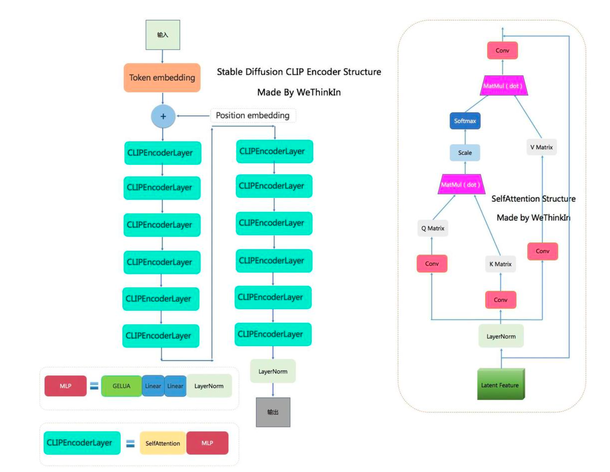

下面油炸PPT老师将使用transofmers库演示调用CLIP Text Encoder，给大家一个更加直观的SD模型的文本编码全过程：

```
from transformers import CLIPTextModel, CLIPTokenizer

# 加载 CLIP Text Encoder模型和Tokenizer
# SD V1.5模型权重百度云网盘：关注油炸PPT老师的公众号WeThinkIn，后台回复：SDV1.5模型，即可获得资源链接
text_encoder = CLIPTextModel.from_pretrained("/本地路径/stable-diffusion-v1-5", subfolder="text_encoder").to("cuda")
text_tokenizer = CLIPTokenizer.from_pretrained("/本地路径/stable-diffusion-v1-5", subfolder="tokenizer")

# 将输入SD模型的prompt进行tokenize，得到对应的token ids特征
prompt = "1girl,beautiful"
text_token_ids = text_tokenizer(
    prompt,
    padding="max_length",
    max_length=text_tokenizer.model_max_length,
    truncation=True,
    return_tensors="pt"
).input_ids

print("text_token_ids' shape:",text_token_ids.shape)
print("text_token_ids:",text_token_ids)

# 将token ids特征输入CLIP Text Encoder模型中输出77x768的Text Embeddings特征
text_embeddings = text_encoder(text_token_ids.to("cuda"))[0] # 由于CLIP Text Encoder模型输出的是一个元组，所以需要[0]对77x768的Text Embeddings特征进行提取
print("text_embeddings' shape:",text_embeddings.shape)
print(text_embeddings)

---------------- 运行结果 ----------------
text_token_ids' shape: torch.Size([1, 77])
text_token_ids: tensor([[49406,   272,  1611,   267,  1215, 49407, 49407, 49407, 49407, 49407,
         49407, 49407, 49407, 49407, 49407, 49407, 49407, 49407, 49407, 49407,
         49407, 49407, 49407, 49407, 49407, 49407, 49407, 49407, 49407, 49407,
         49407, 49407, 49407, 49407, 49407, 49407, 49407, 49407, 49407, 49407,
         49407, 49407, 49407, 49407, 49407, 49407, 49407, 49407, 49407, 49407,
         49407, 49407, 49407, 49407, 49407, 49407, 49407, 49407, 49407, 49407,
         49407, 49407, 49407, 49407, 49407, 49407, 49407, 49407, 49407, 49407,
         49407, 49407, 49407, 49407, 49407, 49407, 49407]])
text_embeddings' shape: torch.Size([1, 77, 768])
tensor([[[-0.3884,  0.0229, -0.0522,  ..., -0.4899, -0.3066,  0.0675],
         [-0.8425, -1.1393,  1.2756,  ..., -0.2595,  1.6293, -0.7857],
         [ 0.1753, -0.9846,  0.1879,  ...,  0.0664, -1.4935, -1.2614],
         ...,
         [ 0.2039, -0.7296, -0.3212,  ...,  0.6748, -0.5813, -0.7323],
         [ 0.1921, -0.7344, -0.3045,  ...,  0.6803, -0.5852, -0.7230],
         [ 0.2114, -0.6436, -0.3047,  ...,  0.6624, -0.5575, -0.7586]]],
       device='cuda:0', grad_fn=<NativeLayerNormBackward0>)

```

一般来说，我们提取CLIP Text Encoder模型最后一层特征作为CrossAttention模块的输入， **但是开源社区的不断实践为我们总结了如下经验：当我们生成二次元内容时，可以选择提取CLIP Text Encoder模型倒数第二层特征；当我们生成三次元（真实场景）内容时，可以选择提取CLIP Text Encoder模型最后一层的特征。这让油炸PPT老师想起了SRGAN以及感知损失，其也是提取了VGG网络的中间层特征才达到了最好的效果，AI领域的“传承”与共性，往往在这些不经意间，让人感到人工智能的魅力与美妙。**

由于CLIP训练时所采用的最大Token数是77，所以在SD模型进行前向推理时，当输入Prompt的Token数量超过77时，将通过Clip操作拉回77，而如果Token数不足77则会使用padding操作得到77x768。 **如果说全卷积网络的设计让图像输入尺寸不再受限，那么CLIP的这个设置就让输入的文本长度不再受限（可以是空文本）** 。无论是非常长的文本，还是空文本，最后都将得到一样维度的特征矩阵。

同时在SD模型的训练中，一般来说CLIP的整体性能是足够支撑我们的下游细分任务的，所以 **CLIP Text Encoder模型参数是冻结的，我们不需要对其重新训练** 。

在AIGC时代，我们使用语言文字表达的创意与想法，轻松让Stable Diffusion生成出一幅幅精美绝伦，创意十足，飞速破圈的图片。而这些背后，都有CLIP的功劳， **CLIP不仅仅连接了文本和图像，也连接了AI行业与千万个需要生成图片和视频的行业，AI绘画的ToC普惠如此之强，油炸PPT老师认为CLIP就是那个“隐形冠军”** 。

## 3.5 SD官方训练细节解析

上面我们已经介绍了Stable Diffusion的核心网络结构，在本节中我们再介绍一下SD的官方训练细节，主要包括训练数据、训练过程、训练资源、模型测评等。

### **（1）SD官方训练数据集**

首先我们介绍一下训练数据集，Stable Diffusion是在 [LAION-5B数据集](https://link.zhihu.com/?target=https%3A//laion.ai/blog/laion-5b/) **（包含58.5 亿个高质量图像文本数据对）** 的一个子集 **LAION 2B-en 数据集（23.2 亿个纯英语高质量图像文本数据对）** 上进行训练的。

LAION-5B是一个大规模的图像-文本对数据集，由LAION（Large-scale Artificial Intelligence Open Network）组织发布。这个数据集包含了大约5.85亿个经过CLIP模型筛选的图像-文本对，是当前AIGC领域非常热门的公开图像-文本对数据集，旨在推动机器学习和人工智能领域，特别是在视觉和语言融合、生成模型等方面的研究和应用。

LAION 2B-en 数据集的元信息（图片的width、height以及对应的Text length）统计分析如下所示：


可以看到，LAION 2B-en 数据集中的图片长宽均大于256的数据量有1324M，大于512的数据量有488M，大于1024的数据量有76M。同时LAION 2B-en 数据集中图片对应的文本标签的平均长度为67。

LAION数据集中除了上面讲到的图片元信息外，每张图片还包含以下信息：

- URL：图像对应的URL；
- similarity：图像和对应文本的余弦相似度，使用CLIP ViT-B/32计算；
- pwatermark：表示图片为含水印图片的概率，使用图片 [watermark detector](https://link.zhihu.com/?target=https%3A//github.com/LAION-AI/LAION-5B-WatermarkDetection) 检测；
- punsafe：表示图片是不是NSFW图片，使用 [clip based detector](https://link.zhihu.com/?target=https%3A//github.com/LAION-AI/CLIP-based-NSFW-Detector) 来评估；

### **（2）SD官方训练过程**

上面我们已经讲完LAION数据集的内容，接下来我们再介绍一下SD官方训练的具体过程。

**SD的训练是多阶段的，** 先在256x256尺寸上预训练，然后在512x512尺寸上微调训练，不同的阶段产生了不同的版本：

- SD 1.1：先在LAION2B-en数据集上用256x256分辨率训练237,000步（LAION2B-en数据集中256分辨率以上的数据一共有1324M）；然后在LAION-5B的 [高分辨率数据集](https://link.zhihu.com/?target=https%3A//huggingface.co/datasets/laion/laion-high-resolution) （ laion-high-resolution ：LAION-5B数据集中图像分辨率在1024x1024以上的样本，共170M样本）用512x512分辨率接着训练194,000步。
- SD 1.2：以SD 1.1为初始权重，在laion-improved-aesthetics数据集（LAION2B-en数据集中美学评分在5分以上并且分辨率大于512x512的无水印数据子集，一共约有600M个样本。这里设置了pwatermark>0.5为水印图片的规则来过滤含有水印的图片）上用512x512分辨率训练了515,000步。
- SD 1.3：以SD 1.2为初始权重，在laion-improved-aesthetics数据集上继续用512x512分辨率训练了195,000步，并且采用了CFG技术（训练时以10%的概率dropping掉Text Embeddings）进行优化。
- SD 1.4：以SD 1.2为初始权重，在laion-aesthetics v2 5+数据集上采用CFG技术用512x512分辨率训练了225,000步。
- SD 1.5：以SD 1.2为初始权重，在laion-aesthetics v2 5+数据集上采用CFG技术用512x512分辨率训练了595,000步。

根据上面官方的训练过程，我们可以看到SD 1.3、SD 1.4以及SD 1.5模型都是在SD 1.2的基础上结合CFG技术在laion-improved-aesthetics和laion-aesthetics v2 5+数据集持续训练得到的不同阶段的模型权重， **目前最热门的版本是Stable Diffusion 1.5模型** 。

### **（3）SD官方训练资源**

官方在从0到1训练SD模型时，一共配置了 **32台8卡A100服务器** （32 x 8 x A100_40GB GPUs）作为算力，AI绘画核心模型的诞生成本确实很高。

同时设置单张GPU的训练batch size为2，并设置gradient accumulation steps=2，SD模型训练时 **总的batch size = 32x8x2x2 = 2048** 。

SD官方训练时 **优化器采用AdamW** ，在训练初期采用warmup，在初始10,000步后 **学习速率升到0.0001** ，后面保持不变（constant）。

SD模型总的训练时间，在32台8卡A100服务器马力全开时共花费了150,000/（32x8）= 586小时约等于25天。

### **（4）SD模型测评**

对于AI绘画模型，目前常用的定量指标是 **FID** （Fréchet inception distance）和 **CLIP score** ，其中FID可以衡量生成图像的逼真度（image fidelity），而CLIP score可以测评生成图像与输入文本的一致性。其中FID值越低越好，而CLIP score则越大越好。

当CFG的gudiance scale参数设置不同时，FID和CLIP score会发生变化，下图为8种不同的gudiance scale参数情况下，SD模型在COCO2017验证集上的评测结果，注意这里是zero-shot评测（SD模型并没有在COCO训练数据集上微调）：

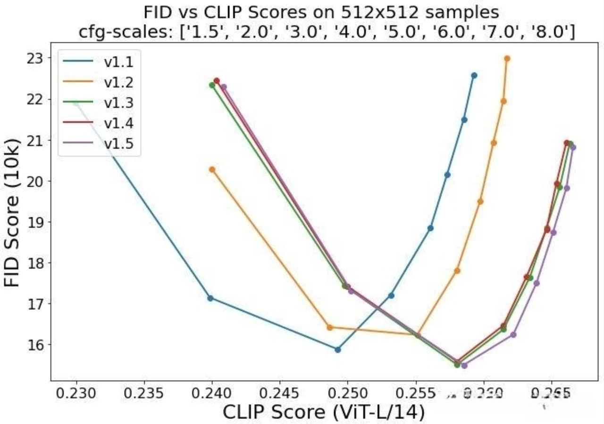

SD 1.1-1.5效果测评

从上图可以看到，SD 1.5模型整体效果是最好的。

# 4. 从0到1搭建使用Stable Diffusion模型进行AI绘画（全网最详细讲解）

目前能够加载Stable Diffusion模型并进行图像生成的框架有四种：

1. ComfyUI框架
2. SD.Next框架
3. Stable Diffusion WebUI框架
4. diffusers框架

接下来， **为了让大家能够从0到1搭建使用Stable Diffusion这个当前开源生态最繁荣的AI绘画基础大模型，油炸PPT老师将详细的讲解如何用这四个框架构建Stable Diffusion推理流程。** 那么，跟随着油炸PPT老师的脚步，让我们开始吧。

## 4.1 零基础使用ComfyUI搭建Stable Diffusion推理流程

[ComfyUI](https://link.zhihu.com/?target=https%3A//github.com/comfyanonymous/ComfyUI) 是一个 **基于节点式** 的Stable Diffusion AI绘画工具。和Stable Diffusion WebUI相比，ComfyUI **通过将Stable Diffusion模型生成推理的pipeline拆分成独立的节点，实现了更加精准的工作流定制和清晰的可复现性。**

目前ComfyUI能够非常成熟的使用Stable Diffusion模型，下面是油炸PPT老师使用ComfyUI来加载Stable Diffusion模型并生成图片的完整Pipeline：

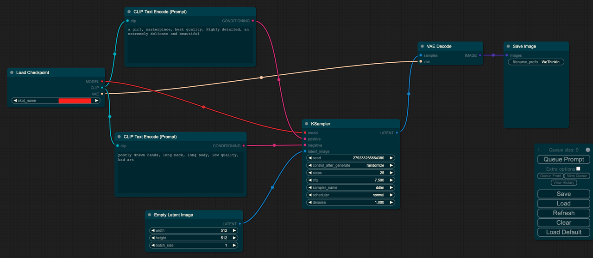

使用ComfyUI来加载Stable Diffusion模型

**大家可以看到上图是文生图的工作流** ，另外大家只需关注油炸PPT老师的公众号 **WeThinkIn** ，并回复“ **ComfyUI** ”，就能获取文生图，图生图，图像Inpainting，ControlNet以及图像超分在内的所有Stable Diffusion经典工作流json文件，大家只需在ComfyUI界面右侧 **点击Load按钮** 选择对应的json文件，即可加载对应的工作流，开始愉快的AI绘画之旅。

话说回来，下面油炸PPT老师将带着大家一步一步使用ComfyUI搭建Stable Diffusion推理流程，从而实现上图所示的生成过程。

首先，我们需要安装ComfyUI框架，这一步非常简单，在 **命令行** 输入如下代码即可：

```
git clone https://github.com/comfyanonymous/ComfyUI.git

```

安装好后，我们可以看到本地的ComfyUI文件夹。

ComfyUI框架安装到本地后，我们需要安装其依赖库，我们只需以下操作：

```
cd ComfyUI #进入下载好的ComfyUI文件夹中
pip install -r requirements.txt -i https://pypi.tuna.tsinghua.edu.cn/simple some-package

```

完成这些配置工作后，我们就可以配置模型了，我们将Stable Diffusion模型放到 **ComfyUI/models/checkpoints/路径下** 。这样以来，等我们开启可视化界面后，就可以选择Stable Diffusion模型进行AI绘画了。

接下来，我们就可以启动ComfyUI了！我们到 **ComfyUI/路径下，运行main.py** 即可：

```
python main.py --listen --port 8888

```

运行完成后，可以看到命令行中出现的log：

```
To see the GUI go to: http://0.0.0.0:8888

```

我们将 [http:// 0.0.0.0:8888](https://link.zhihu.com/?target=http%3A//0.0.0.0%3A8888) 输入到我们本地的网页中，即可打开如上图所示的ComfyUI可视化界面，愉快的使用Stable Diffusion模型生成我们想要的图片了。

接下来就是ComfyUI的节点式模块讲解了，具体如下所示：


Stable Diffusion XL Base模型使用的注释

油炸PPT老师已经进行了比较详细的注释，首先大家可以在红框中选择我们的模型（Stable Diffusion），接着填入Prompt和负向Prompt，并且配置生成推理过程的参数（迭代次数，CFG，Seed等），然后在绿色框中设置好生成图片的分辨率，然后在紫色框中 **点击Queue Prompt按钮** ，整个推理过程就开始了。等整个推理过程完成之后，生成的图片会在图中黄色箭头所指的地方进行展示，并且会同步 **将生成图片保存到本地的ComfyUI/output/路径下** 。

到此为止，油炸PPT老师已经详细讲解了如何使用ComfyUI来搭建Stable Diffusion模型进行AI绘画，大家可以按照油炸PPT老师的步骤进行尝试。

## 4.2 零基础使用SD.Next搭建Stable Diffusion推理流程

[SD.Next](https://link.zhihu.com/?target=https%3A//github.com/vladmandic/automatic) 原本是Stable Diffusion WebUI的一个分支，再经过不断的迭代优化后，最终成为了一个独立版本。

SD.Next与Stable Diffusion WebUI相比，包含了更多的高级功能，也 **兼容Stable Diffusion, Stable Diffusion XL, Kandinsky, DeepFloyd IF等模型结构** ，是一个功能十分强大的AI绘画框架。

那么我们马上开始SD.Next的搭建与使用吧。

首先，我们需要安装SD.Next框架，这一步非常简单，在 **命令行** 输入如下代码即可：

```
git clone https://github.com/vladmandic/automatic

```

安装好后，我们可以看到本地的automatic文件夹。

SD.Next框架安装到本地后，我们需要安装其依赖库，我们只需以下操作：

```
cd automatic #进入下载好的automatic文件夹中
pip install -r requirements.txt -i https://pypi.tuna.tsinghua.edu.cn/simple some-package

```

除了安装依赖库之外，还需要配置SD.Next所需的 repositories 插件，我们需要运行一下代码：

```
cd automatic #进入下载好的automatic文件夹中
python installer.py

```

如果发现extensions插件下载速度较慢，出现很多报错，大家可以直接使用油炸PPT老师已经配置好的资源包，可以快速启动SD.Next框架。SD.Next资源包可以关注公众号 **WeThinkIn** ，后台回复“ **SD.Next资源** ”获取。

在完成了依赖库和 repositories 插件的安装后，我们就可以配置模型了，我们将Stable Diffusion模型放到 **/automatic/models/Stable-diffusion/路径下** 。这样以来，等我们开启可视化界面后，就可以选择Stable Diffusion模型用于推理生成图片了。

完成上述的步骤后，我们可以启动SD.Next了！我们到 **/automatic/路径下，运行launch.py** 即可：

```
python launch.py --listen --port 8888

```

运行完成后，可以看到命令行中出现的log：

```
To see the GUI go to: http://0.0.0.0:8888

```

我们将 [http:// 0.0.0.0:8888](https://link.zhihu.com/?target=http%3A//0.0.0.0%3A8888) 输入到我们本地的网页中，即可打开如下图所示的SD.Next可视化界面，愉快的使用Stable Diffusion模型进行AI绘画了。

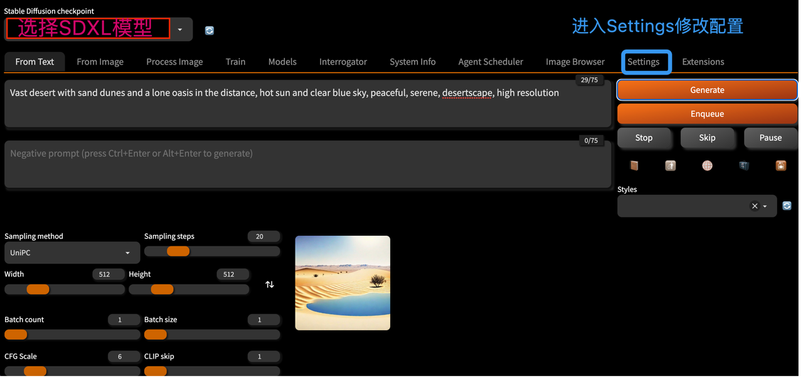

automatic可视化界面

我们只需要在可视化觉面中选择SD模型，并且输入Prompt，最后点击Generate，我们就可以使用SD.Next加载Stable Diffusion进行AI绘画了！

## 4.3 零基础使用Stable Diffusion WebUI搭建Stable Diffusion推理流程

**目前Stable Diffusion WebUI可以说是开源社区使用Stable Diffusion模型进行AI绘画最热门的框架。**

[Stable Diffusion WebUI](https://link.zhihu.com/?target=https%3A//github.com/AUTOMATIC1111/stable-diffusion-webui) 是 **AI绘画领域最为流行的框架** ，其生态极其繁荣，非常多的上下游插件能够与Stable Diffusion WebUI一起完成诸如AI视频生成，AI证件照生成等工作流，可玩性非常强。

接下来，咱们就使用这个流行框架搭建Stable Diffusion推理流程吧。

首先，我们需要下载安装Stable Diffusion WebUI框架，我们只需要在 **命令行** 输入如下代码即可：

```
git clone https://github.com/AUTOMATIC1111/stable-diffusion-webui.git

```

安装好后，我们可以看到本地的stable-diffusion-webui文件夹。

下面我们需要安装其依赖库，我们进入Stable Diffusion WebUI文件夹，并进行以下操作：

```
cd stable-diffusion-webui #进入下载好的automatic文件夹中
pip install -r requirements.txt -i https://pypi.tuna.tsinghua.edu.cn/simple some-package

```

和SD.Next的配置流程类似，我们还需要配置Stable Diffusion WebUI的 repositories 插件，我们需要运行下面的代码：

```
sh webui.sh

#主要依赖包括：BLIP CodeFormer generative-models k-diffusion stable-diffusion-stability-ai taming-transformers

```

如果发现 repositories 插件下载速度较慢，出现很多报错，don't worry，大家可以直接使用油炸PPT老师已经配置好的资源包，可以快速启动Stable Diffusion WebUI框架。Stable Diffusion WebUI资源包可以关注公众号 **WeThinkIn** ，后台回复“ **WebUI资源** ”获取。

在完成了依赖库和 repositories 插件的安装后，我们就可以配置模型了，我们将Stable Diffusion模型放到 **/stable-diffusion-webui/models/Stable-diffusion/路径下** 。这样以来，等我们开启可视化界面后，就可以选择Stable Diffusion模型用于推理生成图片了。

完成上述的步骤后，我们可以启动Stable Diffusion WebUI了！我们到 **/stable-diffusion-webui/路径下，运行launch.py** 即可：

```
python launch.py --listen --port 8888

```

运行完成后，可以看到命令行中出现的log：

```
To see the GUI go to: http://0.0.0.0:8888

```

我们将 [http:// 0.0.0.0:8888](https://link.zhihu.com/?target=http%3A//0.0.0.0%3A8888) 输入到我们本地的网页中，即可打开如下图所示的Stable Diffusion WebUI可视化界面，愉快的使用Stable Diffusion模型进行AI绘画了。


Stable Diffusion WebUI可视化界面

进入Stable Diffusion WebUI可视化界面后，我们可以在红色框中选择SD模型，然后在黄色框中输入我们的Prompt和负向提示词，同时在绿色框中设置我们想要生成的图像分辨率（ **推荐设置成768x768** ），然后我们就可以点击Generate按钮，进行AI绘画了。

等待片刻后，图像就生成好了，并展示在界面的右下角，同时也会保存到 **/stable-diffusion-webui/outputs/txt2img-images/路径下，** 大家可以到对应路径下查看。

## 4.4 零基础使用diffusers搭建Stable Diffusion推理流程

在diffusers库中能够非常快速的构建Stable Diffusion推理流程，由于diffusers目前没有现成的可视化界面，油炸PPT老师将在Jupyter Notebook中搭建完整的Stable Diffusion推理工作流，让大家能够快速的学习掌握。

首先，我们需要安装diffusers库，并确保diffusers的版本 >= 0.18.0，我们只需要在命令行中输入一下命令进行安装即可：

```
# 命令行中加入：-i https://pypi.tuna.tsinghua.edu.cn/simple some-package 表示使用清华源下载依赖包，速度非常快！
pip install diffusers --upgrade -i https://pypi.tuna.tsinghua.edu.cn/simple some-package

显示如下log表示安装成功：
Successfully installed diffusers-0.18.2 huggingface-hub-0.16.4

```

接着，我们继续安装其他的依赖库：

```
pip install transformers==4.27.0 accelerate==0.12.0 safetensors==0.2.7 invisible_watermark -i https://pypi.tuna.tsinghua.edu.cn/simple some-package

显示如下log表示安装成功：
Successfully installed transformers-4.27.0 accelerate==0.12.0 safetensors==0.2.7 invisible_watermark-0.2.0

```

完成了上述依赖库的安装，我们就可以搭建Stable Diffusion模型的完整工作流了。

首先，我们可以看到Stable Diffusion模型的文生图流程如下所示：

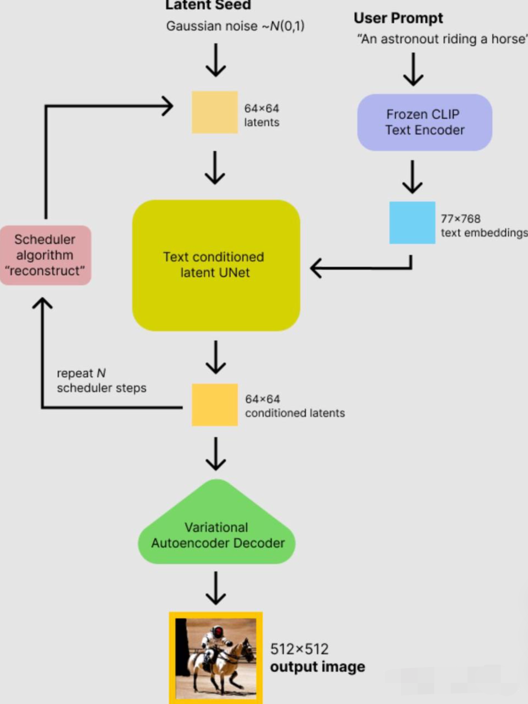

SD模型文生图流程

接着我们如果想要运行Stable Diffusion模型，我们可以直接使用diffusers的完整pipeline流程。

```
#首先，安装相关依赖
pip install diffusers transformers scipy ftfy accelerate

#读取diffuers库
from diffusers import StableDiffusionPipeline

#初始化SD模型，加载预训练权重
pipe = StableDiffusionPipeline.from_pretrained("/本地路径/stable-diffusion-v1-5")

#使用GPU加速
pipe.to("cuda")

#如GPU的内存少于10GB，可以加载float16精度的SD模型
pipe = StableDiffusionPipeline.from_pretrained("/本地路径/stable-diffusion-v1-5", revision="fp16", torch_dtype=torch.float16)

#接下来，我们就可以运行pipeline了
prompt = "a photograph of an astronaut riding a horse"

image = pipe(prompt).images[0]

# 由于没有固定seed，每次运行代码，我们都会得到一个不同的图片。

```

我们打开下载的预训练文件夹，可以看到预训练模型主要由以下几个部分组成：

text_encoder和tokenizer，scheduler，unet，vae。

其中text_encoder，scheduler，unet，vae分别代表了上面讲到过的SD模型的核心结构。

同时我们还可以看到Tokenizer文件夹，表示标记器。Tokenizer首先将Prompt中的每个词转换为一个称为标记（token）的数字，符号化（Tokenization）是计算机理解单词的方式。然后，通过text_encoder将每个标记都转换为一个768值的向量，称为嵌入（embedding），用于U-Net的condition。

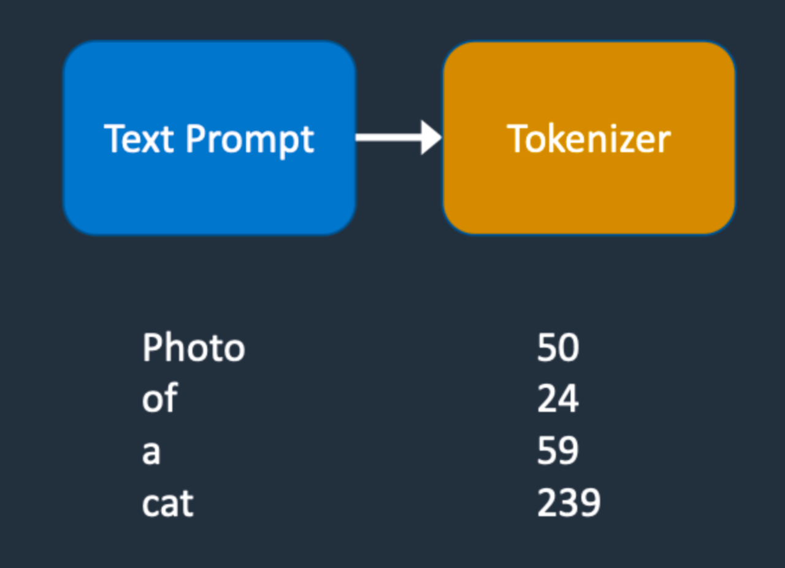

Tokenizer的作用

有时候我们运行完pipeline之后，会出现纯黑色图片，这表示我们本次生成的图片触发了NSFW机制，出现了一些违规的图片，我们可以修改seed重新进行生成。

我们可以自己设置seed，来达到对图片生成的控制。

```
import torch

#manual_seed(1024)：每次使用具有相同种子的生成器时，都会获得相同的图像输出。
generator = torch.Generator("cuda").manual_seed(1024)

image = pipe(prompt, guidance_scale=7.5, generator=generator).images[0]

```

将pipeline的完整结构梳理好之后，我们再对一些核心参数进行讲解：

1. **num_inference_steps** 。num_inference_steps表示我们对图片进行噪声优化的次数。一般来说，我们可以选择num_inference_steps = 20/25/50，数值越大，图片生成效果越好，但同时生成所需的时间就越长。
2. **guidance_scale** ，代表无分类指引（Classifier-free guidance，guidance_scale，CFG）是一个控制文本提示对扩散过程的影响程度的值。简单来说就是在加噪阶段将条件控制下预测的噪音和无条件下的预测噪音组合在一起来确定最终的噪声。通常guidance_scale可以选7-8.5之间，如果使用非常大的值，图像可能看起来不错，但多样性会降低。

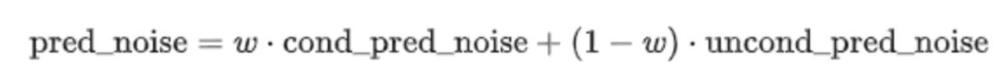

其中 w 代表CFG，当 w 越大时，condition起的作用越大，即生成的图像更和输入文本一致，当 w 被设置为 0 时，图像生成是无条件的，文本提示会被忽略。

1. **输出尺寸**

SD在默认情况下会输出 512 \times 512 尺寸的图片。我们也可以自定义设置图片尺寸，油炸PPT老师建议如下：

1. 建议height和width都是8的倍数。
2. 低于 512 可能会导致图像质量较低。
3. 创建非正方形图像的推荐方法是在一维中使用 512 ，另一个使用更大的值。

```
prompt = "a photograph of an astronaut riding a horse"

# Number of denoising steps
steps = 25

# Scale for classifier-free guidance
CFG = 7.5

image = pipe(prompt, guidance_scale=CFG, height=512, width=768, num_inference_steps=steps).images[0]

```

除了将预训练模型整体加载，我们还可以将SD模型的不同组件单独加载：

```
from transformers import CLIPTextModel, CLIPTokenizer
from diffusers import AutoencoderKL, UNet2DConditionModel, PNDMScheduler
from diffusers import LMSDiscreteScheduler

# 单独加载VAE模型
vae = AutoencoderKL.from_pretrained("runwayml/stable-diffusion-v1-5", subfolder="vae")

# 单独家在CLIP模型和tokenizer
tokenizer = CLIPTokenizer.from_pretrained("openai/clip-vit-large-patch14")
text_encoder = CLIPTextModel.from_pretrained("openai/clip-vit-large-patch14")

# 单独加载U-Net模型
unet = UNet2DConditionModel.from_pretrained("runwayml/stable-diffusion-v1-5", subfolder="unet")

# 单独加载调度算法
scheduler = LMSDiscreteScheduler(beta_start=0.00085, beta_end=0.012, beta_schedule="scaled_linear", num_train_timesteps=1000)

```

## 4.5 Stable Diffusion生成示例

示例一：未来主义的城市风格
```

Prompt：Stunning sunset over a futuristic city, with towering skyscrapers and flying vehicles, golden hour lighting and dramatic clouds, high detail, moody atmosphere

Negative Prompt：(EasyNegative),(watermark), (signature), (sketch by bad-artist), (signature), (worst quality), (low quality), (bad anatomy), NSFW, nude, (normal quality)

```
Stable Diffusion生成结果：


示例二：天堂海滩风格
```

Prompt：Serene beach scene with crystal clear water and white sand, tropical palm trees swaying in the breeze, perfect paradise, seascape

Negative Prompt：(EasyNegative),(watermark), (signature), (sketch by bad-artist), (signature), (worst quality), (low quality), (bad anatomy), NSFW, nude, (normal quality)
```
Stable Diffusion生成结果：


示例三：未来机甲风格
```

Prompt：Giant robots fighting in a futuristic city, with buildings falling and explosions all around, intense, fast-paced, dramatic, stylized, futuristic

Negative Prompt：(EasyNegative),(watermark), (signature), (sketch by bad-artist), (signature), (worst quality), (low quality), (bad anatomy), NSFW, nude, (normal quality)
```
Stable Diffusion生成结果：


示例四：马斯克风格
```
Prompt：Elon Musk standing in a workroom, in the style of industrial machinery aesthetics, deutscher werkbund, uniformly staged images, soviet, light indigo and dark bronze, new american color photography, detailed facial features

Negative Prompt：(EasyNegative),(watermark), (signature), (sketch by bad-artist), (signature), (worst quality), (low quality), (bad anatomy), NSFW, nude, (normal quality)
```
Stable Diffusion生成结果：


更多关于SD v1，SDv2，SDXL的生成效果对比，大家可以从这个项目中查看：

[benchmark/SDXL_SDv2.1_SDv1.5](https://link.zhihu.com/?target=https%3A//github.com/TonyLianLong/stable-diffusion-xl-demo/blob/benchmark/benchmark/SDXL_SDv2.1_SDv1.5.md)

# **5. Stable Diffusion经典应用场景**

## **5.1 文本生成图像**

输入：prompt

输出：图像


其中Load Checkpoint模块代表对SD模型的主要结构进行初始化（VAE，U-Net），CLIP Text Encode表示文本编码器，可以输入prompt和negative prompt，来控制图像的生成，Empty Latent Image表示初始化的高斯噪声，KSampler表示调度算法以及SD相关生成参数，VAE Decode表示使用VAE的解码器将低维度的隐空间特征转换成像素空间的生成图像。

## **5.2 图片生成图片**

输入：图像 + prompt

输出：图像


其中Load Checkpoint模块代表对SD模型的主要结构进行初始化（VAE，U-Net），CLIP Text Encode表示文本编码器，可以输入prompt和negative prompt，来控制图像的生成，Load Image表示输入的图像，KSampler表示调度算法以及SD相关生成参数，VAE Encode表示使用VAE的编码器将输入图像转换成低维度的隐空间特征，VAE Decode表示使用VAE的解码器将低维度的隐空间特征转换成像素空间的生成图像。

与文字生成图片的过程相比，图片生成图片的预处理阶段，先把噪声添加到隐空间特征中。我们设置一个去噪强度（Denoising strength）控制加入多少噪音。如果它是0，就不添加噪音。如果它是1，则添加最大数量的噪声，使潜像成为一个完整的随机张量，如果将去噪强度设置为1，就完全相当于文本转图像，因为初始潜像完全是随机的噪声。

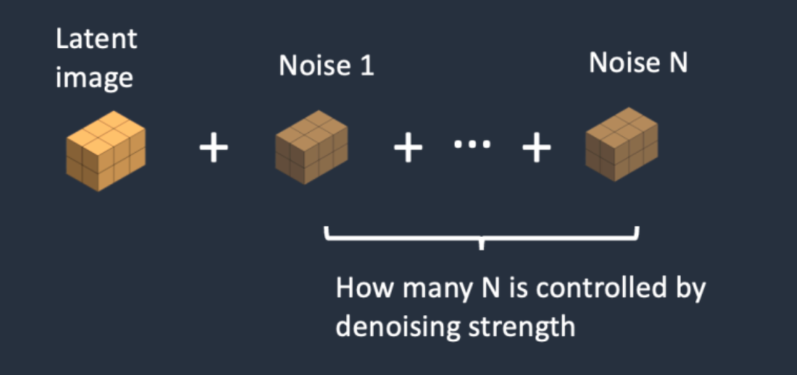

去噪强度（Denoising strength）控制噪音的加入量

## **5.3 图像inpainting**

图像inpainting最初用在 **图像修复** 上，是一种图像修复技术，可以将图像中的水印、噪声、标志等瑕疵去除。

传统的图像inpainting过程可以分为两步：1. 找到图像中的瑕疵部分 2. 对瑕疵部分进行重绘去除，并填充图像内容使得图像语义完整自然。

在AIGC时代，图像inpainting再次繁荣，成为Stable Diffusion的经典应用场景，在 **图像编辑** 上重新焕发生机。

那么什么是图像编辑呢？

**图像编辑是指对图像进行修改、调整和优化的过程。它可以包括对图像的颜色、对比度、亮度、饱和度等进行调整，以及修复图像中的缺陷、删除不需要的元素、添加新的图像内容等操作。**

**在SD中，主要是通过给定一个想要编辑的区域mask，并在这个区域mask圈定的范围内进行文本生成图像的操作，从而编辑mask区域的图像内容。**

SD中的图像inpainting流程如下所示：

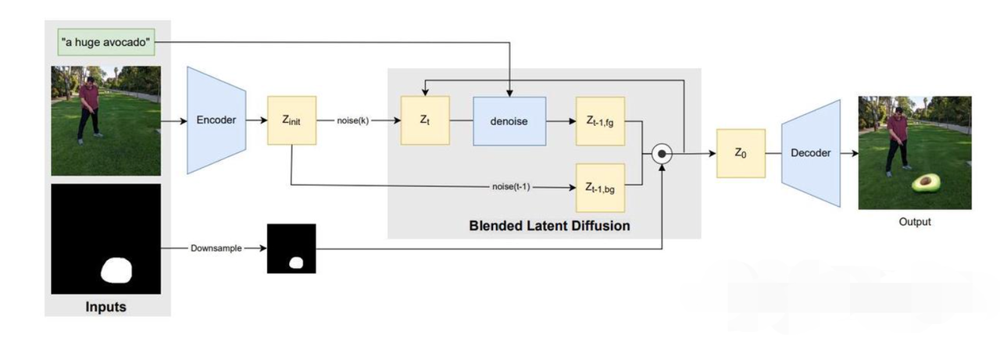

SD中的图像inpainting流程

从上图可以看出，图像inpainting整体上和图生图流程一致，不过为了保证mask以外的图像区域不发生改变，在去噪过程的每一步，我们利用mask将Latent Feature中不需要重建的部分都替换成原图最初的特征，只在mask部分进行特征的重建与优化。

在加入了mask后，SD的输入的通道数也发生了变化，文生图和图生图任务中，SD的输入是64x64x4，而在图像inpainting任务中，增加了经过mask处理的图像的Latent Feature（64x64x4）和mask（64x64x1），所以此时SD的输入为64x64x9。

下面油炸PPT老师再用 **节点式结构图** 展示一下SD模型进行图像inpainting的全部流程：


SD模型进行图像inpainting的节点式结构图

输入：图像 + mask + prompt

输出：图像

其中Load Checkpoint模块代表对SD模型的主要结构进行加载（VAE，U-Net）。CLIP Text Encode表示SD模型的文本编码器，可以输入prompt和negative prompt，来引导图像的生成。Load Image表示输入的图像和mask。KSampler表示调度算法以及SD相关生成参数。VAE Encode表示使用VAE的Encoder将输入图像和mask转换成Latent Feature，VAE Decode表示使用VAE的Decoder将Latent Feature重建成像素级图像。

下面就是进行图像inpainting的直观过程：


由于图像inpainting和图生图的操作一样，只是在SD模型原有的基础上扩展了它的能力，并没有去微调SD模型，所以如何调整各种参数成为了生成优质图片的关键。

当然的，也有专门用于图像inpainting的SD模型，比如说 **Stable Diffusion I npainting 模型，其是以SD 1.2为基底模型微调而来** 。Stable Diffusion I npainting 模型由于经过专门的inpainting训练，在生成细节上比起常规SD模型会更好，但是相应的常规文生图的能力会有一定的减弱。

## **5.4 使用controlnet辅助生成图片**

输入：素描图 + prompt

输出：图像


其中Load Checkpoint模块代表对SD模型的主要结构进行初始化（VAE，U-Net），CLIP Text Encode表示文本编码器，可以输入prompt和negative prompt，来控制图像的生成，Load Image表示输入的ControlNet需要的预处理图，Empty Latent Image表示初始化的高斯噪声，Load ControlNet Model表示对ControlNet进行初始化，KSampler表示调度算法以及SD相关生成参数，VAE Decode表示使用VAE的解码器将低维度的隐空间特征转换成像素空间的生成图像。

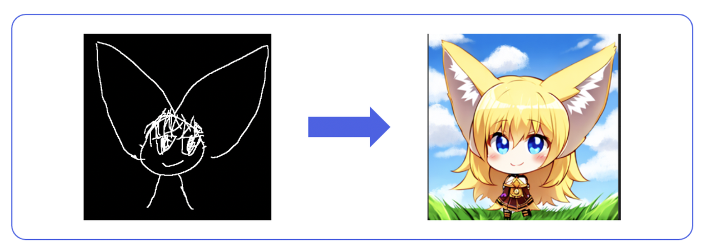

使用ControlNet辅助生成图片

## **5.5 超分辨率重建**

输入：prompt/（图像 + prompt）

输入：图像


其中Load Checkpoint模块代表对SD模型的主要结构进行初始化（VAE，U-Net），CLIP Text Encode表示文本编码器，可以输入prompt和negative prompt，来控制图像的生成，Empty Latent Image表示初始化的高斯噪声，Load Upscale Model表示对超分辨率重建模型进行初始化，KSampler表示调度算法以及SD相关生成参数，VAE Decode表示使用VAE的解码器将低维度的隐空间特征转换成像素空间的生成图像，Upscale Image表示将生成的图片进行超分。

# 6. 从0到1上手使用Stable Diffusion训练自己的AI绘画模型（全网最详细讲解）

**我们能够看到目前AI绘画领域的持续繁荣，很大程度上是因为开源社区持续出现新的不同主题、不同画风、不同概念的Stable Diffusion模型与LoRA模型。** 有了这些模型，我们就能有更多的AI绘画工具，有更多的奇思妙想能够去尝试实现，而这也是AI绘画领域能够爆发式繁荣的关键。

那么我们如何快速训练Stable Diffusion和LoRA模型呢。不要担心，油炸PPT老师详细梳理总结了从0到1的保姆级训练教程，方便大家快速上手学习入门与进阶。

## 6.0 Stable Diffusion训练资源分享

- **SD训练脚本：油炸PPT老师整理优化过的SD完整训练资源SD-Train项目，大家只用在SD-Train中就可以完成SD的模型训练工作，方便大家上手实操。** SD-Train项目资源包可以通过关注公众号 **WeThinkIn** ，后台回复“ **SD-Train** ”获取。
- **本文中的SD微调训练数据集：宝可梦数据集，** 大家可以关注公众号 **WeThinkIn** ，后台回复“ **宝可梦数据集** ”获取。
- **本文中的SD微调训练底模型：WeThinkIn_SD_二次元模型** ，大家可以关注油炸PPT老师的公众号 **WeThinkIn** ，后台回复“ **SD_二次元模型** ”获取模型资源链接。
- **本文中的SD LoRA训练数据集：小丑女数据集** ，大家可以关注公众号 **WeThinkIn** ，后台回复“ **小丑女数据集** ”获取。
- **本文中的SD LoRA训练底模型：WeThinkIn_SD_真人模型** ，大家可以关注油炸PPT老师的公众号 **WeThinkIn** ，后台回复“ **SD_真人模型** ”获取模型资源链接。

## 6.1 Stable Diffusion模型训练初识

Stable Diffusion系列模型的训练流程主要分成以下几个步骤：

1. **训练集制作：** 数据质量评估，标签梳理，数据清洗，数据标注，标签清洗，数据增强等。
2. **训练文件配置：** 预训练模型选择，训练环境配置，训练步数设置，其他超参数设置等。
3. **模型训练：** 运行SD模型/LoRA模型训练脚本，使用TensorBoard监控模型训练等。
4. **模型测试：** 将训练好的自训练SD模型/LoRA模型用于效果评估与消融实验。

讲完Stable Diffusion模型训练的方法论，油炸PPT老师再向大家推荐一些Stable Diffusion的训练资源：

- [https:// github.com/Linaqruf/koh ya-trainer](https://link.zhihu.com/?target=https%3A//github.com/Linaqruf/kohya-trainer) （本文中主要的训练工程）
- [https:// github.com/huggingface/ diffusers/tree/main/examples](https://link.zhihu.com/?target=https%3A//github.com/huggingface/diffusers/tree/main/examples) （huggingface的 diffusers 开源训练框架）
- **油炸PPT老师整理优化过的SD完整训练资源SD-Train项目，大家只用在SD-Train中就可以完成SD的模型训练工作，方便大家上手实操。** SD-Train项目资源包可以通过关注公众号 **WeThinkIn** ，后台回复“ **SD-Train** ”获取。

目前我们对Stable Diffusion的训练流程与所需资源有了初步的了解，接下来，就让我们跟随着油炸PPT老师的脚步，从0到1使用Stable Diffusion模型和训练资源一起训练自己的Stable Diffusion绘画模型与LoRA绘画模型吧！

## 6.2 配置训练环境与训练文件

### **（1）原生SD/SD LoRA训练项目**

首先，我们需要下载训练资源，只需在命令行输入下面的代码即可：

```
git clone https://github.com/Linaqruf/kohya-trainer.git

```

**kohya-trainer项目包含了Stable Diffusion的核心训练脚本，** 并通过 **kohya-trainer-XL.ipynb和kohya-LoRA-trainer-XL.ipynb文件来生成数据集制作脚本和训练参数配置脚本** 。

我们打开kohya-trainer项目可以看到，里面包含了两个SD的训练脚本和对应的.ipynb文件：


kohya-trainer项目

正常情况下，我们需要运行kohya-trainer项目中两个SD的.ipynb文件的内容，生成训练数据处理脚本（数据标注，数据预处理，数据Latent特征提取，数据分桶（make buckets）等）和训练参数配置文件。

我们使用数据处理脚本完成训练集的制作，然后再运行kohya-trainer项目的训练脚本，同时读取训练参数配置文件，为SD模型的训练过程配置超参数。

完成上面一整套流程，SD模型的训练流程就算跑通了。但是 **由于kohya-trainer项目中的两个.ipynb文件内容较为复杂，整个流程比较繁锁，对新手非常不友好，并且想要完成一整套训练流程，我们还需要对两个.ipynb文件进行改写，非常不方便。**

### **（2）一键上手的SD-Train项目：方便快速训练SD/SD LoRA模型**

**所以在此基础上，油炸PPT老师这边帮大家对两个项目进行了整合归纳，总结了简单易上手的SD模型以及相应LoRA模型的训练流程，制作成SD完整训练资源SD-Train项目，大家只用在SD-Train中就可以完成SD的模型训练工作，方便大家上手实操。**

SD-Train项目资源包可以通过关注公众号 **WeThinkIn** ，后台回复“ **SD-Train** ”获取。

下面是SD-Train项目中的主要内容，大家可以看到SD的 **数据处理脚本** 与 **kohya-trainer-XL.ipynb和kohya-LoRA-trainer-XL.ipynb两个文件中提取出来的训练参数文件** 都已包含在内，大家可以方便的进行使用：


SD-Train：Stable Diffusion完整训练资源

我们下载了SD-Train项目后，首先进入SD-Train项目中，安装SD训练所需的依赖库，我们只需在命令行输入以下命令即可：

```
cd SD-Train

pip install -r requirements.txt -i https://pypi.tuna.tsinghua.edu.cn/simple some-package

# accelerate库的版本需要重新检查一遍，需要安装accelerate==0.16.0版本才能兼容SD的训练
pip install accelerate==0.16.0 -i https://pypi.tuna.tsinghua.edu.cn/simple some-package

```

在完成上述的依赖库安装后， **我们需要确认一下目前的Python、PyTroch、CUDA以及cuDNN的版本是否兼容** ，我们只需要在命令行输入以下命令即可：

```
# Python版本推荐3.8或者3.9，两个版本皆可
>>> python
Python 3.9
# 加载PyTroch
>>> import torch
# 查看PyTorch版本
>>> print(torch.__version__)
1.13.1+cu117
# 查看CUDA版本
>>> print(torch.version.cuda)
11.7
# 查看cuDNN版本
>>> print(torch.backends.cudnn.version())
8500
# 查看PyTroch、CUDA以及cuDNN的版本是否兼容，True代表兼容
>>> print(torch.cuda.is_available())
True

```

如果大家在本地自己验证的时候和油炸PPT老师上述的版本一致，说明SD模型的训练环境已经全部兼容！

安装和验证好所有SD训练所需的依赖库后， **我们还需要设置一下SD的训练环境参数，我们主要是用accelerate库的能力，accelerate库能让PyTorch的训练和推理变得更加高效简洁** 。我们只需在命令行输入以下命令，并对每个设置逐一进行填写即可：

```
# 输入以下命令，开始对每个设置进行填写
accelerate config

# 开始进行训练环境参数的配置
In which compute environment are you running? # 选择This machine，即本机
This machine

# 选择单卡或是多卡训练，如果是多卡，则选择multi-GPU，若是单卡，则选择No distributed training
Which type of machine are you using?
multi-GPU

# 几台机器用于训练，一般选择1台。注意这里是指几台机器，不是几张GPU卡
How many different machines will you use (use more than 1 for multi-node training)? [1]: 1

# torch dynamo，DeepSpeed，FullyShardedDataParallel，Megatron-LM等环境参数，不需要配置
Do you wish to optimize your script with torch dynamo?[yes/NO]: # 输入回车即可
Do you want to use DeepSpeed? [yes/NO]:  # 输入回车即可
Do you want to use FullyShardedDataParallel? [yes/NO]:    # 输入回车即可
Do you want to use Megatron-LM ? [yes/NO]:       # 输入回车即可

# 选择多少张卡投入训练
How many GPU(s) should be used for distributed training? [1]:2

# 设置投入训练的GPU卡id，如果是全部的GPU都投入训练，则输入all即可。
What GPU(s) (by id) should be used for training on this machine as a comma-seperated list? [all]:all

# 训练精度，可以选择fp16
Do you wish to use FP16 or BF16 (mixed precision)?
fp16

# 完成配置后，配置文件default_config.yaml会保存在/root/.cache/huggingface/accelerate下
accelerate configuration saved at /root/.cache/huggingface/accelerate/default_config.yaml

```

后续进行SD与LoRA模型训练的时候，只需要加载对应的default_config.yaml配置文件即可使用配置好的训练环境，具体的调用方法，后续的6.4和6.5章节中会详细讲解。

### **（3）依赖文件与依赖模型配置**

还有一点需要注意的是，我们进行SD模型的训练时， **SD的CLIP Text Encoder会调用clip-vit-large-patch14这个配置文件** 。一般情况下SD模型会从huggingface上将配置文件下载到~/.cache/huggingface/目录中，但是由于网络原因很可能会下载失败，从而导致训练的失败。

所以为了让大家能更方便的训练SD模型， **油炸PPT老师已经将clip-vit-large-patch14这个配置文件放入SD-Train项目的utils_json文件夹中，并且已经为大家配置好依赖路径，大家只要使用SD-Train项目便无需做任何修改。** 如果大家想要修改clip-vit-large-patch14依赖文件夹的调用路径，大家可以找到SD-Train/library/model_util.py脚本中的第898行，将"utils_json/clip-vit-large-patch14"部分修改成自己的本地自定义路径比如“/本地路径/utils_json/clip-vit-large-patch14”即可。

完成上述的流程后，接下来我们就可以进行SD训练数据的制作和训练脚本的配置流程了！

## 6.3 SD训练数据集制作

首先，我们需要对数据集进行清洗，和传统深度学习时代一样，数据清洗工作依然占据了AIGC时代模型训练 **70%-80%左右的时间** 。

并且这个过程必不可少， **因为数据质量决定了机器学习的上限，而算法和模型只是在不断逼近这个上限而已** 。

我们需要筛除分辨率较低，质量较差（ **比如说768*768分辨率的图片< 100kb** ），存在破损，以及和任务目标无关的数据，接着去除数据里面可能包含的水印，干扰文字等，最后就可以开始进行数据标注了。

数据标注可以分为 **自动标注** 和 **手动标注** 。自动标注主要依赖像BLIP和Waifu Diffusion 1.4这样的模型，手动标注则依赖标注人员。

## **（1）使用BLIP自动标注caption**

我们先用BLIP对数据进行自动标注， **BLIP输出的是自然语言标签** ，我们进入到SD-Train/finetune/路径下，运行以下代码即可获得自然语言标签（caption标签）：

```
cd SD-Train/finetune/
python make_captions.py "/数据路径" --batch_size=8 --caption_weights="/本地BLIP模型路径" --beam_search --min_length=5 --max_length=75 --debug --caption_extension=".caption" --max_data_loader_n_workers=2

```

**注意：在使用BLIP进行数据标注时需要依赖bert-base-uncased模型，油炸PPT老师这边已经帮大家配置好了，大家只要使用SD-Train项目便无需做任何修改。** 同时，如果大家想要修改bert-base-uncased模型的调用路径，可以找到SD-Train/finetune/blip/blip.py脚本的第189行，将“../bert-base-uncased”部分修改成自己的本地自定义路径比如“/本地路径/bert-base-uncased”即可。

从上面的代码可以看到，我们 **第一个传入的参数是训练集的路径** 。下面油炸PPT老师再向大家介绍一下其余参数的意义：

- -caption_weights：表示加载的本地BLIP模型，如果不传入本地模型路径，则默认从云端下载BLIP模型。
- -batch_size：表示每次传入BLIP模型进行前向处理的数据数量。
- -beam_search：设置为波束搜索，默认Nucleus采样。
- -min_length：设置caption标签的最短长度。
- -max_length：设置caption标签的最长长度。
- -debug：如果设置，将会在BLIP前向处理过程中，打印所有的图片路径与caption标签内容，以供检查。
- -caption_extension：设置caption标签的扩展名，一般为".caption"。
- -max_data_loader_n_workers：设置大于等于2，加速数据处理。

讲完了上述的运行代码以及相关参数，下面油炸PPT老师再举一个美女图片标注的例子， 让大家能够更加直观的感受到BLIP处理数据生成caption标签的过程：


SD模型数据标注流程：使用BLIP进行自然语言自动标注

上图是单个图像的标注示例，整个数据集的标注流程也是同理的。 **等整个数据集的标注后，Stable Diffusion训练所需的caption标注就完成了** 。

## **（2）使用Waifu Diffusion v1.4模型自动标注tag标签**

接下来我们可以使用Waifu Diffusion v1.4模型对训练数据进行自动标注， **Waifu Diffusion v1.4模型输出的是tag关键词标签，其由一个个关键词短语组成：**


Tag关键词标签示例

这里需要注意的是， **调用Waifu Diffusion v1.4模型需要安装特定版本（2.10.0）的Tensorflow库** ，不然运行时会报“DNN library is not found“错误。我们只需要在命令行输入以下命令即可完成Tensorflow库的版本检查与安装适配：

```
# 检查Tenosrflow库的版本
pip show tensorflow
# 如果出现下面的log信息，说明Tenosrflow库的版本已经做好了适配
Name: tensorflow
Version: 2.10.0
Summary: TensorFlow is an open source machine learning framework for everyone.

# 如果显示Tenosrflow库并未安装或者版本不对，可以输入下面的命令进行重新安装
pip install tensorflow==2.10.0 -i https://pypi.tuna.tsinghua.edu.cn/simple some-package

```

完成上述的环境配置后，我们依然进入到SD-Train/finetune/路径下，运行以下代码即可获得tag自动标注：

```
cd SD-Train/finetune/
python tag_images_by_wd14_tagger.py "/数据路径" --batch_size=8 --model_dir="../tag_models/wd-v1-4-moat-tagger-v2" --remove_underscore --general_threshold=0.35 --character_threshold=0.35 --caption_extension=".txt" --max_data_loader_n_workers=2 --debug --undesired_tags=""

```

从上面的代码可以看到，我们 **第一个传入的参数是训练集的路径。然后油炸PPT老师再详细介绍一下传入** Waifu Diffusion v1.4自动标注的其他主要参数：

- -batch_size：表示每次传入Waifu Diffusion v1.4模型进行前向处理的数据数量。
- -model_dir：表示加载的本地Waifu Diffusion v1.4模型路径。
- -remove_underscore：如果开启，会将输出tag关键词中的下划线替换为空格（long_hair -> long hair）。
- -general_threshold： **设置常规tag关键词的筛选置信度** ，比如1girl、solo、long_hair、1boy、smile、looking at viewer、blue eyes、hat、full body、dress等 **约7000个基础概念标签** 。
- -character_threshold： **设置特定人物特征tag关键词的筛选置信度** ，比如初音未来（hatsune miku）、 羽衣啦啦 （agoromo lala）、博麗靈夢（hakurei reimu）等 **约2100个特定人物特征标签** 。
- -caption_extension：设置tag关键词标签的扩展名，一般为".txt"即可。
- max_data_loader_n_workers：设置大于等于2，加速数据处理。
- -debug：如果设置，将会在Waifu Diffusion 1.4模型前向处理过程中，打印所有的图片路径与tag关键词标签内容，供我们检查。
- -undesired_tags：设置不需要保存的tag关键词。

下面油炸PPT老师依然用之前的美女图片作为例子， 让大家能够更加直观的感受到 **Waifu Diffusion v1.4模型处理数据生成tag关键词标签的过程：**


SD模型数据标注流程：使用Waifu Diffusion 1.4模型进行tag自动标注

上图是单个图像的标注示例，整个数据集的标注流程也是同理的。 **等整个数据集都完成标注后，Stable Diffusion训练所需的tag关键词标签就完成了** 。

上面油炸PPT老师是使用了Waifu Diffusion v1.4系列模型中的wd-v1-4-moat-tagger-v2模型，目前Waifu Diffusion v1.4系列模型一共有5个版本，除了刚才介绍到的wd-v1-4-moat-tagger-v2模型，还包括wd-v1-4-swinv2-tagger-v2模型、wd-v1-4-convnext-tagger-v2模型、wd-v1-4-convnextv2-tagger-v2模型以及wd-v1-4-vit-tagger-v2模型。

油炸PPT老师也分别对他们的自动标注效果进行了对比，在这里油炸PPT老师使用了一张生成的“猫女”图片，分别输入到这五个自动标注模型中，一起来看看不同版本的Waifu Diffusion v1.4模型的效果：


Waifu Diffusion v1.4系列模型不同版本的自动标注效果

从上图可以看到，在将general_threshold和character_threshold同时设置为0.5时，wd-v1-4-moat-tagger-v2模型的标注效果整体上是最好的，内容丰富且最能反应图片中的语义信息。所以在这里， **油炸PPT老师也推荐大家使用wd-v1-4-moat-tagger-v2模型** 。

大家也可以在SD-Train项目的tag_models文件夹下调用这些模型，进行对比测试，感受不同系列Waifu Diffusion v1.4模型的标注效果。

## **（3）补充标注特殊tag**

完成了caption和tag的自动标注之后，如果我们需要训练一些 **特殊标注** 的话，还可以进行手动的补充标注。

SD-Trian项目中也提供了对数据进行补充标注的代码，油炸PPT老师在这里将其进行提炼总结，方便大家直接使用。

大家可以直接拷贝以下的代码，并按照油炸PPT老师在代码中提供的注释进行参数修改，然后运行代码即可对数据集进行补充标注：

```
import os

# 设置为本地的数据集路径
train_data_dir = "/本地数据集路径"

# 设置要补充的标注类型，包括[".txt", ".caption"]
extension   = ".txt"

# 设置要补充的特殊标注
custom_tag  = "WeThinkIn"

# 若设置sub_folder = "--all"时，将遍历所有子文件夹中的数据；默认为""。
sub_folder  = ""

# 若append设为True，则特殊标注添加到标注文件的末尾
append      = False

# 若设置remove_tag为True，则会删除数据集中所有的已存在的特殊标注
remove_tag  = False
recursive   = False

if sub_folder == "":
    image_dir = train_data_dir
elif sub_folder == "--all":
    image_dir = train_data_dir
    recursive = True
elif sub_folder.startswith("/content"):
    image_dir = sub_folder
else:
    image_dir = os.path.join(train_data_dir, sub_folder)
    os.makedirs(image_dir, exist_ok=True)

# 读取标注文件的函数，不需要改动
def read_file(filename):
    with open(filename, "r") as f:
        contents = f.read()
    return contents

# 将特殊标注写入标注文件的函数，不需要改动
def write_file(filename, contents):
    with open(filename, "w") as f:
        f.write(contents)

# 将特殊标注批量添加到标注文件的主函数，不需要改动
def process_tags(filename, custom_tag, append, remove_tag):
    contents = read_file(filename)
    tags = [tag.strip() for tag in contents.split(',')]
    custom_tags = [tag.strip() for tag in custom_tag.split(',')]

    for custom_tag in custom_tags:
        custom_tag = custom_tag.replace("_", " ")
        if remove_tag:
            while custom_tag in tags:
                tags.remove(custom_tag)
        else:
            if custom_tag not in tags:
                if append:
                    tags.append(custom_tag)
                else:
                    tags.insert(0, custom_tag)

    contents = ', '.join(tags)
    write_file(filename, contents)

def process_directory(image_dir, tag, append, remove_tag, recursive):
    for filename in os.listdir(image_dir):
        file_path = os.path.join(image_dir, filename)

        if os.path.isdir(file_path) and recursive:
            process_directory(file_path, tag, append, remove_tag, recursive)
        elif filename.endswith(extension):
            process_tags(file_path, tag, append, remove_tag)

tag = custom_tag

if not any(
    [filename.endswith(extension) for filename in os.listdir(image_dir)]
):
    for filename in os.listdir(image_dir):
        if filename.endswith((".png", ".jpg", ".jpeg", ".webp", ".bmp")):
            open(
                os.path.join(image_dir, filename.split(".")[0] + extension),
                "w",
            ).close()

# 但我们设置好要添加的custom_tag后，开始整个代码流程
if custom_tag:
    process_directory(image_dir, tag, append, remove_tag, recursive)

```

看完了上面的完整代码流程， **如果大家觉得代码太复杂，don‘t worry，大家只需要复制上面的全部代码，并将train_data_dir ="/本地数据集路径"和custom_tag ="WeThinkIn"设置成自己数据集的本地路径和想要添加的特殊标注，然后运行代码即可，非常简单实用** 。

还是以之前的美女图片为例子，当运行完上面的代码后，可以看到txt文件中，最开头的tag为“WeThinkIn”：


SD模型数据标注流程：手动补充增加特殊tag标签

大家注意， **一般我们会将手动补充的特殊tag放在第一位，因为和caption标签不同，tags标签是有顺序的，最开始的tag权重最大，越靠后的tag权重越小** 。

到这里， **油炸PPT老师已经详细讲解了在Stable Diffusion训练前，如何对数据集进行caption标注，tag标注以及补充一些关键标注的完整步骤与流程** ，在数据标注完毕后，接下来我们就要进入训练数据预处理的阶段了。

## **（4）训练数据预处理**

首先，我们需要对刚才生成的后缀为.caption和.txt的标注文件进行整合，存储成一个json格式的文件，方便后续SD模型训练时调取训练数据与标注。

我们需要进入SD-Train项目的finetune文件夹中，运行merge_all_to_metadata.py脚本即可：

```
cd SD-Train
python ./finetune/merge_all_to_metadata.py "/本地数据路径" "/本地数据路径/meta_clean.json"

```

如下图所示，我们依旧使用之前的美图女片作为例子，运行完merge_all_to_metadata.py脚本后，我们在数据集路径中得到一个meta_clean.json文件，打开可以看到图片名称对应的tag和caption标注都封装在了文件中，让人一目了然，非常清晰。


SD模型训练数据预处理流程：meta_clean.json中封装了图片名称与对应的tag和caption标注

在整理好标注文件的基础上， **我们接下来需要对数据进行分桶与保存Latent特征** ，并在meta_clean.json的基础上，将图片的分辨率信息也存储成json格式，并保存一个新的meta_lat.json文件。

我们需要进入SD-Train项目的finetune文件夹中，运行prepare_buckets_latents.py脚本即可：

```
cd SDXL-Train
python ./finetune/prepare_buckets_latents.py "/本地数据路径" "/本地数据路径/meta_clean.json" "/本地数据路径/meta_lat.json" "想要调用的SD模型路径" --min_bucket_reso=256 --max_bucket_reso=1024 --batch_size 4 --max_data_loader_n_workers=2 --max_resolution "1024,1024" --mixed_precision="no"

```

运行完脚本，我们即可在数据集路径中获得meta_lat.json文件，其在meta_clean.json基础上封装了图片的分辨率信息，用于SD训练时快速进行数据分桶。


meta_lat.json文件在meta_clean.json基础上封装了图片的分辨率信息

同时我们可以看到，美女图片的Latent特征保存为了.npz文件，用于SD模型训练时，快速读取数据的Latent特征，加速训练过程。

好的，到目前为止，我们已经完整的进行了SD训练所需的数据集制作与预处理流程。总结一下，我们在一张美女图片的基础上， **一共获得了以下5个不同的训练配置文件：**

1. meta_clean.json
2. meta_lat.json
3. 自然语言标注（.caption）
4. 关键词tag标注（.txt）
5. 数据的Latent特征信息（.npz）


SD模型所需的训练配置文件

在完成以上所有数据处理过程后，接下来我们就可以进入SD训练的阶段了，我们可以对SD进行全参微调（finetune），也可以基于SD训练对应的LoRA模型。

## 6.4 Stable Diffusion微调（finetune）训练

**微调（finetune）训练是让SD全参数重新训练的一种方法，理想的状态是让SD模型在原有能力的基础上，再学习到一个或几个细分领域的数据特征与分布** ，从而能在工业界，学术界以及竞赛界满足不同的应用需求。

油炸PPT老师为大家举一个形象的例子，让大家能够能好理解SD全参微调的意义。比如我们要训练一个二次元SD模型，应用于二次元领域。那么我们首先需要寻找合适的基于SD的预训练底模型，比如一个能生成二次元图片的SD A模型。然后我们用A模型作为预训练底模型，并收集二次元优质数据作为训练集， **有了模型和数据，再加上油炸PPT老师为大家撰写的SD微调训练全流程攻略，我们就能训练获得一个能生成二次元人物的SD行业模型，并作为二次元相关产品的核心大模型** 。

那么话不多说， **下面油炸PPT老师将告诉大家从0到1使用SD模型进行微调训练的全流程攻略** ，让我们一起来训练属于自己的SD模型吧！

### **（1）SD微调（finetune）数据集制作**

**在SD全参数微调中，SD能够学习到大量的主题，人物，画风或者抽象概念等信息特征** ，所以我们需要对一个细分领域的数据进行广泛的收集，并进行准确的标注。

油炸PPT老师这边收集整理了833张宝可梦数据，包含多样的宝可梦种类，组成 **宝可梦数据集** ，作为本次SD微调训练的训练集。


宝可梦数据集

接下来，我们就可以 **按照本文6.3 Stable Diffusion数据集制作章节里的步骤** ，进行数据的清洗，自动标注，以及添加特殊tag。

油炸PPT老师认为对SD模型进行微调训练主要有 **两个目的** ： **增强SD模型的图像生成能力与增加SD对新prompt的触发能力** 。

我们应该怎么理解这两个目的呢。我们拿宝可梦数据集为例，我们想要让SD模型学习宝可梦的各种特征，包括脸部特征，形状特征，姿势特征，二次元背景特征，以及二次元画风特征等。 **通过训练不断让SD模型“学习”这些数据的内容，从而增强SD模型生成新宝可梦图片的能力** 。与此同时，我们通过自动标注与特殊tag，将图片的特征与标注信息进行对应， **让SD在学习图片数据特征的同时，学习到对应的标注信息，能够在前向推理的过程中，通过二次元的专属标签生成对应的新宝可梦图像** 。

理解了上面的内容，咱们的数据处理部分就告一段落了。 **为了方便大家使用宝可梦数据集进行后续的SD模型微调训练，油炸PPT老师这边已经将处理好的宝可梦数据集开源（包含原数据，标注文件，读取数据的json文件等）** ，大家可以关注公众号 **WeThinkIn** ，后台回复“ **宝可梦数据集** ”获取。

### **（2）SD微调训练参数配置**

本节中，油炸PPT老师主要介绍 **Stable Diffusion全参微调（finetune）训练** 的参数配置和训练脚本。

**油炸PPT老师已经帮大家整理好了SD全参微调训练的全部参数与训练脚本，大家可以在SD-Train项目的train_config文件夹中找到相应的训练参数配置（config文件夹），并且可以在SD-Train项目中运行SD_finetune.sh脚本，进行SD的全参微调训练。**

接下来，油炸PPT老师将带着大家从头到尾走通SD全参微调训练过程，并讲解训练参数的意义。首先，我们可以看到config文件夹中有两个配置文件config_file.toml和sample_prompt.toml，他们分别存储着SD的训练超参数与训练中的验证prompt。


config文件夹中的配置文件config_file.toml和sample_prompt.txt

其中config_file.toml文件主要包含了model_arguments，optimizer_arguments，dataset_arguments，training_arguments，sample_prompt_arguments以及saving_arguments六个维度的的参数信息，下面油炸PPT老师为大家依次讲解各个超参数的作用：

```
[model_arguments]
v2 = false
v_parameterization = false
pretrained_model_name_or_path = "/本地路径/SD模型文件"

```

v2和v_parameterization：两者同时设置为true时，开启Stable Diffusion V2版本的训练。

pretrained_model_name_or_path：读取本地Stable Diffusion预训练模型用于微调训练。

```
[optimizer_arguments]
optimizer_type = "AdamW8bit"
learning_rate = 2e-6
max_grad_norm = 1.0
train_text_encoder = false
lr_scheduler = "constant"
lr_warmup_steps = 0

```
```
optimizer_type：选择优化器类型。一共有：["AdamW"(default), "AdamW8bit", "Lion", "SGDNesterov", "SGDNesterov8bit", "DAdaptation", "AdaFactor"]七种优化器可以选择。其中当我们不进行选择优化器类时，默认会启动AdamW优化器；当我们的显存不太充足时，可以选择AdamW8bit优化器，能降低训练时的显存占用，但代价是轻微地性能损失；Lion优化器是目前优化器方向上最新的版本，性能较为优异，但是使用Lion优化器时学习率需要设置较小，比如设置为AdamW优化器下的 1/3。

learning_rate：训练学习率，单卡推荐设置2e-6，多卡推荐设置1e-7。


其中，new_gradient 是剪裁后的梯度，max_grad_norm 是设定的最大梯度范数阈值，old_gradient_norm 是原始梯度的L2范数，old_gradient 是原始梯度向量。

train_text_encoder：是否在SD模型训练时对Text Encoder进行微调，如果设置为true，则对Text Encoder进行微调。

lr_scheduler：设置学习率调度策略，可以设置成linear, cosine, cosine_with_restarts, polynomial, constant (default), constant_with_warmup, adafactor。如果不单独指定，择默认会使用constant学习率调度策略。

lr_warmup_steps：在启动学习率调度策略前，先固定学习率训练的步数。
```

```
[dataset_arguments]
debug_dataset = false
in_json = "/本地路径/data_meta_lat.json"
train_data_dir = "/本地路径/训练集"
dataset_repeats = 10
shuffle_caption = true
keep_tokens = 0
resolution = "512,512"
caption_dropout_rate = 0
caption_tag_dropout_rate = 0
caption_dropout_every_n_epochs = 0
color_aug = false
token_warmup_min = 1
token_warmup_step = 0

```

debug_dataset：训练时对数据进行debug处理，不让破损数据中断训练进程。

in_json：读取数据集json文件，json文件中包含了数据名称，数据标签，数据分桶等信息。

train_data_dir：读取本地数据集存放路径。

dataset_repeats：整个数据集重复训练的次数，也可以理解为每个epoch中，训练集数据迭代的次数。（ **经验分享：如果数据量级小于一千，可以设置为10；如果数据量级在一千与一万之前，可以设置为5；如果数据量级大于一万，可以设置为2** ）

shuffle_caption：当设置为true时，对训练标签进行打乱，能一定程度提高模型的泛化性。

keep_tokens：在训练过程中，会将txt中的tag进行随机打乱。如果将keep tokens设置为n，那前n个token的顺序在训练过程中将不会被打乱。

resolution：设置训练时的数据输入分辨率，分别是width和height。

caption_dropout_rate：针对一个数据丢弃全部标签的概率，默认为0。

caption_tag_dropout_rate：针对一个数据丢弃部分标签的概率，默认为0。（ **类似于传统深度学习的Dropout逻辑** ）

caption_dropout_every_n_epochs：每训练n个epoch，将数据标签全部丢弃。

color_aug：数据颜色增强， **建议不启用，其与caching latents不兼容，若启用会导致训练时间大大增加** （由于每次训练迭代时输入数据都会改变，无法提前获取 latents）。

token_warmup_min：在训练一开始学习每个数据的前n个tag（标签用逗号分隔后的前n个tag，比如girl，boy，good）

token_warmup_step：训练中学习标签数达到最大值所需的步数，默认为0，即一开始就能学习全部的标签。

```
[training_arguments]
output_dir = "/本地路径/模型权重保存地址"
output_name = "sd_finetune_WeThinkIn"
save_precision = "fp16"
save_n_epoch_ratio = 1
save_state = false
train_batch_size = 1
max_token_length = 225
mem_eff_attn = false
xformers = true
max_train_steps = 2500
max_data_loader_n_workers = 8
persistent_data_loader_workers = true
gradient_checkpointing = false
gradient_accumulation_steps = 1
mixed_precision = "fp16"
clip_skip = 2
logging_dir = "/本地路径/logs"
log_prefix = "sd_finetune_WeThinkIn"

```

output_dir：模型保存的路径。

output_name：模型名称。

save_precision：模型保存的精度，一共有[“None”, "float", "fp16", "bf16"]四种选择，默认为“None”，即FP32精度。

save_n_epoch_ratio：每n个steps保存一次模型权重。

save_state：设置为true时，每次保存模型权重的同时会额外保存训练状态（包括优化器状态等）。

train_batch_size：训练Batch-Size，与传统深度学习一致。

max_token_length：设置Text Encoder最大的Token数，有[None, 150, 225]三种选择，默认为“None”，即75。

mem_eff_attn：对Cross Attention进行轻量化。

xformers：xformers插件可以使SDXL模型在训练时显存减少一半左右。

max_train_steps：SD模型训练的总步数。

max_data_loader_n_workers：数据加载的DataLoader worker数量，默认为8。

persistent_data_loader_workers：能够让DataLoader worker持续挂载，减少训练中每个epoch之间的数据读取时间，但是会增加内存消耗。

gradient_checkpointing：设为true时开启梯度检查，通过以更长的计算时间为代价，换取更少的显存占用。相比于原本需要存储所有中间变量以供反向传播使用，使用了checkpoint的部分不存储中间变量而是在反向传播过程中重新计算这些中间变量。模型中的任何部分都可以使用gradient checkpoint。

gradient_accumulation_steps：如果显存不足，我们可以使用梯度累积步数，默认为1。

mixed_precision：训练中是否使用混合精度，一共有["no", "fp16", "bf16"]三种选择，默认为“no”。

clip_skip：当设置clip_skip为2时，提取CLIP Text Encoder倒数第二层的输出；如果设置clip_skip为1，则提取CLIP Text Encoder倒数最后一层的输出。 **CLIP Text Encoder模型一共有12层，越往深层模型输出的特征就越抽象，跳过过于抽象的信息可以防止过拟合** 。油炸PPT老师推荐 **二次元模型选择 clip_skip = 2，三次元模型选择 clip_skip = 1** 。

logging_dir：设置训练log保存的路径。

log_prefix：增加log文件的文件名前缀，比如sd_finetune_WeThinkIn1234567890。

```
[sample_prompt_arguments]
sample_every_n_steps = 100
sample_sampler = "ddim"

[saving_arguments]
save_model_as = "safetensors"

```

sample_every_n_steps：在训练中每n步测试一次模型效果。

sample_sampler：设置训练中测试模型效果时使用的sampler，可以选择["ddim","pndm","lms","euler","euler_a","heun","dpm_2","dpm_2_a","dpmsolver","dpmsolver++","dpmsingle", "k_lms","k_euler","k_euler_a","k_dpm_2","k_dpm_2_a"]，默认是“ddim”。

save_model_as：每次模型权重保存时的格式，可以选择["ckpt", "safetensors", "diffusers", "diffusers_safetensors"]，目前SD WebUI兼容"ckpt"和"safetensors"格式模型。

### **（3）SD模型训练**

完成训练参数配置后，我们就可以运行训练脚本进行SD模型的全参微调训练了。

**我们本次训练用的底模型选择了WeThinkIn_SD_二次元模型** ，大家可以关注油炸PPT老师的公众号 **WeThinkIn** ，后台回复“ **SD_二次元模型** ”获取模型资源链接。

我们打开SD_finetune.sh脚本，可以看到以下的代码：

```
accelerate launch \
  --config_file accelerate_config.yaml \
  --num_cpu_threads_per_process=8 \
  /本地路径/SD-Train/fine_tune.py \
  --sample_prompts="/本地路径/SD-Train/train_config/sample_prompt.txt" \
  --config_file="/本地路径/SD-Train/train_config/config_file.toml"

```

我们把训练脚本封装在accelerate库里，这样就能启动我们一开始配置的训练环境了。在本文的6.2节中，我们已经详细介绍了如何配置accelerate训练环境，如果我们想要切换不同的训练环境参数，我们只需要将accelerate_config.yaml改成我们所需要的配置文件与路径即可（比如：/本地路径/new_accelrate_config.yaml）。

除了上述的训练环境参数传入，最重要的还是将刚才配置好的config_file.toml和sample_prompt.txt参数传入训练脚本中。

接下里，就到了激动人心的时刻，我们只需在命令行输入以下命令，就能开始SD模型的全参微调训练啦：

```
# 进入SD-Train项目中
cd SD-Train

# 运行训练脚本！
sh SD_finetune.sh

```

训练脚本启动后，会打印出以下的log，方便我们查看整个训练过程的节奏：

```
running training / 学習開始
  # 表示总的训练数据量，等于训练数据 * dataset_repeats: 1024 * 10 = 10240
  num examples / サンプル数: 10240
  # 表示每个epoch需要多少step，以8卡为例，需要10240/ (2 * 8) = 640
  num batches per epoch / 1epochのバッチ数: 640
  # 表示总的训练epoch数，等于total optimization steps / num batches per epoch = 64000 / 640 = 100
  num epochs / epoch数: 100
  # 表示每个GPU卡上的Batch Size数，最终的Batch Size还需要在此基础上*GPU卡数，以8卡为例：2 * 8 = 16
  batch size per device / バッチサイズ: 2
  #表示n个step计算一次梯度，一般设置为1
  gradient accumulation steps / 勾配を合計するステップ数 = 1
  # 表示总的训练step数
  total optimization steps / 学習ステップ数: 64000

```

当我们设置1024分辨率+FP16精度+xformers加速时， **SD模型进行Batch Size = 1的微调训练需要约17.1G的显存，进行Batch Size=4的微调训练需要约26.7G的显存** ，所以想要微调训练SD模型，最好配置一个24G以上的显卡，能让我们更佳从容地进行训练。

**到此为止，油炸PPT老师已经将SD全参微调训练的全流程都做了详细的拆解** ，等训练完成后，我们就可以获得属于自己的SD模型了！

### **（4）加载自训练SD模型进行AI绘画**

SD模型微调训练完成后，会将模型权重保存在我们之前设置的output_dir路径下。接下来，我们使用Stable Diffusion WebUI作为框架， **加载SD宝可梦模型进行AI绘画** 。

在本文4章中，油炸PPT老师已经详细讲解了如何搭建Stable Diffusion WebUI框架，未使用过的朋友可以按照这个流程快速搭建起Stable Diffusion WebUI。

要想使用SD模型进行AI绘画，首先我们需要将训练好的SD宝可梦模型放入Stable Diffusion WebUI的/models/Stable-diffusion文件夹下。

然后我们在Stable Diffusion WebUI中分别选用SD宝可梦模型即可：


完成上图中的操作后，我们就可以进行新宝可梦图片的生成啦！

下面是使用本教程训练出来的SD宝可梦模型生成的图片：


自训练SD大模型生成新宝可梦图片

**到这里，关于SD微调训练的全流程攻略就全部展示给大家了，大家如果觉得好，欢迎给油炸PPT老师的劳动点个赞，支持一下油炸PPT老师，谢谢大家！**

**如果大家对SD全参数微调训练还有想要了解的知识或者不懂的地方，欢迎在评论区留言，油炸PPT老师也会持续优化本文内容，能让大家都能快速了解SD训练知识，并训练自己的专属SD绘画模型！**

## 6.5 基于Stable Diffusion **训练LoRA模型**

**基于Stable Diffusion的生态之所以如此繁荣，LoRA模型绝对功不可没。LoRA模型的训练成本是Stable Diffusion全参微调训练成本1/10左右** ，不断训练各式各样的LoRA模型并发布到开源社区是持续繁荣SD生态的高效选择。

关于LoRA模型的LoRA的核心基础知识，LoRA的优势，热门LoRA模型推荐等内容，可以阅读油炸PPT老师之前写的文章：

在本节， **油炸PPT老师将告诉大家从0到1使用SD模型训练对应的LoRA的全流程攻略** ，让我们一起来训练属于自己的SD LoRA模型吧！

### **（1）SD LoRA数据集制作**

首先，我们需要确定数据集主题，比如说人物，画风或者某个抽象概念等。本次我们选择用油炸PPT老师自己搜集的人物主题数据集—— **小丑女数据集** 来进行SD LoRA模型的训练。


小丑女数据集

**为了方便大家使用小丑女数据集进行后续的LoRA训练，油炸PPT老师这边已经将处理好的小丑女数据集开源（包含原数据，标注文件，读取数据的json文件等）** ，大家可以关注公众号 **WeThinkIn** ，后台回复“ **小丑女数据集** ”获取。

### **（2）SD LoRA训练参数配置**

训练Stable Diffusion LoRA的参数配置与Stable Diffusion全参微调的训练配置有相同的部分（上述的前六个维度），也有LoRA的特定参数需要配置（additional_network_arguments）。

下面我们首先看看这些共同的维度中，有哪些需要注意的事项吧：

```
[model_arguments] # 与SD全参微调训练一致
v2 = false
v_parameterization = false
pretrained_model_name_or_path = "/本地路径/SD模型文件"

[optimizer_arguments] # 与SD全参微调训练一致
optimizer_type = "AdamW8bit"
learning_rate = 0.0001 # 在未设置U-Net学习率和CLIP Text Encoder学习率时生效。
max_grad_norm = 1.0
lr_scheduler = "constant"
lr_warmup_steps = 0

[dataset_arguments] # 与SD全参微调训练一致
debug_dataset = false
in_json = "/本地路径/data_meta_lat.json"
train_data_dir = "/本地路径/训练集"
dataset_repeats = 10
shuffle_caption = true
keep_tokens = 0
resolution = "512,512"
caption_dropout_rate = 0
caption_tag_dropout_rate = 0
caption_dropout_every_n_epochs = 0
color_aug = false
token_warmup_min = 1
token_warmup_step = 0

[training_arguments] # 与SD全参微调训练不一致
output_dir = "/本地路径/模型权重保存地址"
output_name = "sd_LoRA_WeThinkIn"
save_precision = "fp16"
save_every_n_epochs = 1
train_batch_size = 6
max_token_length = 225
mem_eff_attn = false
xformers = true
max_train_epochs = 10 #max_train_epochs设置后，会覆盖掉max_train_steps，即两者同时存在时，以max_train_epochs为准
max_data_loader_n_workers = 8
persistent_data_loader_workers = true
gradient_checkpointing = false
gradient_accumulation_steps = 1
mixed_precision = "fp16"
clip_skip = 2
logging_dir = "/本地路径/logs"
log_prefix = "sd_LoRA_WeThinkIn"
lowram = true # 开启能够节省显存。

[sample_prompt_arguments] # 与SD全参微调训练一致
sample_every_n_epochs = 1
sample_sampler = "ddim"

[saving_arguments] # 与SD全参微调训练一致
save_model_as = "safetensors"

```

除了上面的参数，训练SD LoRA时还需要设置一些专属参数，这些参数非常关键，下面油炸PPT老师将给大家一一讲解：

```
[additional_network_arguments]
no_metadata = false
unet_lr = 0.0001
text_encoder_lr = 5e-5
network_module = "networks.lora"
network_dim = 32
network_alpha = 16
network_train_unet_only = false
network_train_text_encoder_only = false

```

no_metadata：保存模型权重时不附带Metadata数据，建议关闭，能够减少保存下来的LoRA大小。

unet_lr：设置U-Net 的学习率，默认值是1e-4。 **当我们将LoRA的network_dimension设置的较大时，比如128，这是我们需要设置更多的steps与更小的学习率（1e-5）** 。

text_encoder_lr：设置CLIP Text Encoder的学习率，默认为5e-5。一般来说，CLIP Text Encoder 的学习率可以设置成unet_lr的1/15。 **小学习率有助于CLIP Text Encoder对tag更敏感** 。

network_module：选择训练的LoRA模型结构，可以从["networks.lora", "networks.dylora", "lycoris.kohya"]中选择， **最常用的LoRA结构默认选择"networks.lora"** 。

network_dim：设置LoRA的RANK，设置的数值越大表示表现力越强，但同时需要更多的显存和时间来训练。

network_alpha：设置缩放权重，用于防止下溢并稳定训练的alpha值。

network_train_unet_only：如果设置为true，那么只训练U-Net部分。

network_train_text_encoder_only：如果设置为true，那么只训练CLIP Text Encoder部分。

### **（3）SD LoRA关键参数详解**

【1】LoRA模型变体：LoCon

LoCon模型 Conventional LoRA 在LoRA模型的基础上，还用同样的方法调整了ResNet。

【2】LoRA模型变体：LoHa

LoHa LoRA with Hadamard Product: 通过哈达马积进一步降低参数的量，理论上在相同的dim下能容纳更多的信息。

LoHa论文： [FedPara Low-Rank Hadamard Product For Communication-Efficient Federated Learning](https://link.zhihu.com/?target=https%3A//openreview.net/pdf%3Fid%3Dd71n4ftoCBy) 。

【3】train_batch_size对SD LoRA模型训练的影响

和传统深度学习一样，train_batch_size即为训练时的batch size，表示一次性送入SD LoRA模型进行训练的图片数量。

我们在训练SD LoRA模型时，一般来说数据量级是比较小的（10-300为主），我们可以设置batch size为2-6即可。

当我们设置训练的基础分辨率为1024*1024时，在24G显存的NVIDIA GeForce RTX 3090显卡上最大batch_size可以设置为6。

一般来说batch size = 2^n 时计算效率较高。

### **（4）SD LoRA模型训练**

完成训练参数配置后，我们就可以运行训练脚本进行SD LoRA模型的训练了。

**我们本次训练用的底模型选择了WeThinkIn_SD_真人模型** ，大家可以关注油炸PPT老师的公众号 **WeThinkIn** ，后台回复“ **SD_真人模型** ”获取模型资源链接。

我们打开SD_fintune_LoRA.sh脚本，可以看到以下的代码：

```
accelerate launch \
  --config_file accelerate_config.yaml \
  --num_cpu_threads_per_process=8 \
  /本地路径/SD-Train/train_network.py \
  --sample_prompts="/本地路径/SD-Train/train_config/LoRA_config/sample_prompt.txt" \
  --config_file="/本地路径/SD-Train/train_config/LoRA_config/config_file.toml"

```

我们把训练脚本封装在accelerate库里，这样就能启动我们一开始配置的训练环境了，同时我们将刚才配置好的config_file.toml和sample_prompt.txt参数传入训练脚本中。

接下里，就到了激动人心的时刻，我们只需在命令行输入以下命令，就能开始SD LoRA训练啦：

```
# 进入SD-Train项目中
cd SD-Train

# 运行训练脚本！
sh SD_fintune_LoRA.sh

```

当我们基于SD训练SD LoRA模型时，我们设置分辨率为1024+FP16精度+xformers加速时， **进行Batch Size = 1的微调训练需要约8G的显存，进行Batch Size=4的微调训练需要约19.1G的显存** ，所以想要微调训练SD LoRA模型，最好配置一个12G以上的显卡，能让我们更佳从容地进行训练。

### **（5）加载SD LoRA模型进行AI绘画**

SD LoRA模型训练完成后，会将模型权重保存在我们之前设置的output_dir路径下。接下来，我们使用Stable Diffusion WebUI作为框架，加载SD LoRA模型进行AI绘画。

在本文4.3节零基础使用Stable Diffusion WebUI搭建Stable Diffusion推理流程中，油炸PPT老师已经详细讲解了如何搭建Stable Diffusion WebUI框架，未使用过的朋友可以按照这个流程快速搭建起Stable Diffusion WebUI。

要想使用SD LoRA进行AI绘画，首先我们需要将SD底模型和SD LoRA模型分别放入Stable Diffusion WebUI的/models/Stable-diffusion文件夹和/models/Lora文件夹下。

然后我们在Stable Diffusion WebUI中分别选用底模型与LoRA即可：


小丑女LoRA出图效果

后续马上补充，大家敬请期待！ **码字确实不易，希望大家能一键三连，多多点赞！**

# **7. Stable Diffusion不同版本模型的对比**

## **7.1** Stable Diffusion 2.0系列模型

现在Stable Diffusion XL已经发布了， **我们会发现Stable Diffusion 2.x系列模型非常尴尬** 。

**如果将AIGC时代与传统深度学习时代进行对比的话，那么Stable Diffusion全系列模型无疑就是AIGC时代的“YOLO”。Stable Diffusion 1.x是“YOLOv1”，那么Stable Diffusion 2.x就是“YOLOv2”，最新的Stable Diffusion XL就是“YOLOv3”。**

就如同YOLOv2一样，Stable Diffusion 2.x系列同样面临相同的境遇，前有Stable Diffusion开创新时代的余威与繁荣的开源生态助力，后有Stable Diffusion XL这个整体性能强大的最新版本模型和飞速繁荣的生态，都让Stable Diffusion 2.x系列模型成为了“鸡肋”。

但是， **油炸PPT老师相信Stable Diffusion 2.x系列模型依然是AIGC时代里一个有效的AI绘画工具，可以作为相关的知识储备** 。

与此同时， **Stable Diffusion 2.x系列模型中的优化技术与Tricks，是AI绘画领域的一笔宝贵财富，能让工业界、学术界、竞赛界都能从中获得灵感与思路** 。

Stable Diffusion 2.0模型在2022年11月由Stability AI公司发布。与SD 1.5模型相比，SD 2.0模型主要改动了 **模型结构** 和 **训练数据** 两个部分。

### **（1）SD 2.0模型结构改动**

Stable Diffusion 1.x系列中的Text Encoder部分是采用OpenAI开源的 **CLIP ViT-L/14模型** ，其模型参数量为123.65M；而Stable Diffusion V2系列则换成了新的 OpenCLIP 模型—— **CLIP ViT-H/14 模型** （基于LAION-2b数据集训练），其参数量为354.03M，比SD 1.x的Text Encoder模型大了3倍左右。具体对比如下表所示：

| Model name | Text Params | Imagenet top1 | Mscoco image retrieval at 5 | Flickr30k image retrieval at 5 |
| --- | --- | --- | --- | --- |
| Openai L/14 | 123.65M | 75.4% | 61% | 87% |
| CLIP ViT-H/14 | 354.03M | 78.0% | 73.4% | 94% |

可以看到，SD 2.0使用的CLIP ViT-H/14模型相比SD 1.x使用的 OpenAI CLIP ViT-L/14模型，在Imagenet top1（分类准确率75.4% -> 78.0%）、Mscoco image retrieval at 5（多模态检索任务指标61% -> 73.4%）以及Flickr30k image retrieval at 5（多模态检索任务指标87% -> 94%）上均有明显的提升，表明CLIP ViT-H/14模型的Text Encoder能够输出更准确的文本语义信息。

与此同时，SD 2.0在Text Encoder部分还有一个细节优化是使用Text Encoder倒数第二层的特征来作为U-Net模型的文本信息输入，这与SD 1.x所使用的Text Encoder倒数第一层的特征不同。Imagen和novelai在训练时也采用了Text Encoder倒数第二层的特征， **因为倒数第一层的特征存在部分丢失细粒度文本信息的情况，而这些细粒度文本信息有助于SD模型更快地学习某些概念特征** 。

**SD2.0和SD1.x的VAE部分是一致的** 。由于切换了Text Encoder模型，在SD 2.0中U-Net的cross attention dimension从SD 1.x U-Net的768变成了1024，从而U-Net部分的整体参数量有一些增加（ **860M -> 865M** ），除此之外 **SD 2.0 U-Net与SD 1.x U-Net的整体架构是一样的** 。与此同时，在SD 2.0 U-Net中不同stage的attention模块的attention head dim是不固定的（5、10、20、20），而SD 1.x则是不同stage的attention模块采用固定的attention head数量（8），这个改动不会影响模型参数量。

### **（2）SD 2.0官方训练数据与训练过程**

除了上面讲到的Text Encoder模型的区别，Stable Diffusion V1和Stable Diffusion V2在 **训练数据也有较大的不同** ：

Stable Diffusion 2.0模型从头开始在LAION-5B数据集的子集（该子集通过LAION-NSFW分类器过滤掉了NSFW数据，过滤标准是punsafe=0.1和美学评分>= 4.5）上 **以256x256的分辨率训练了550k步，** 然后接着 **以512x512的分辨率在同一数据集上进一步训练了850k步** 。

前面讲过SD 1.x系列模型主要采用LAION-5B中美学评分>= 5以上的子集来训练，而到了SD 2.0版本采用美学评分>= 4.5以上的子集， **这相当于扩大了训练数据集** 。

**S tabilityAi 官方基于SD 2.0架构一共发布了5个版本的模型** ，具体如下所示：

- **512-base-ema.ckpt：** SD 2.0的基础版本模型，训练方法刚才已经讲过。
- **768-v-ema.ckpt：** 先在512-base-ema.ckpt模型的基础上，使用 [v-objective（Progressive Distillation for Fast Sampling of Diffusion Models）](https://link.zhihu.com/?target=https%3A//arxiv.org/abs/2202.00512) 损失函数训练了150k步，接着以768x768分辨率在LAION-5B数据集的子集上又进行了140k步的训练最终得到768-v-ema.ckpt模型。
- **512-depth-ema.ckpt：** 在512-base-ema.ckpt模型的基础上继续进行了200k步的微调训练。只不过在训练过程中增加了图像深度图（深度图信息由 [MiDaS](https://link.zhihu.com/?target=https%3A//github.com/isl-org/MiDaS) 算法生成）作为控制条件。具体的深度信息控制效果如下所示：
- 


512-depth-ema.ckpt模型的效果

- **512-inpainting-ema.ckpt：** 在512-base-ema.ckpt模型的基础上继续训练了200k步。和 stable-diffusion-inpainting 模型一样，使用 [LAMA](https://link.zhihu.com/?target=https%3A//github.com/advimman/lama) 中提出的Mask生成策略，将Mask作为一个额外条件加入模型训练，从而获得一个图像inpainting模型。


512-inpainting-ema.ckpt模型的inpainting效果

- **x4-upscaling-ema.ckpt：** 在包含分辨率大于2048x2048的图像的LAION的1000万子集上训练了1.25M步骤。该模型在大小为512x512的裁剪上训练，并且是一个文本引导的潜在放大扩散模型。除了文本输入外，它还接收一个噪声等级作为输入参数，可以用来根据预定义的扩散计划向低分辨率输入添加噪声。

**SD V1和SD V2的性能和功能对比** ：

- **艺术表现** ：Stable Diffusion v2的用户指出，与v1相比，它在表示名人或艺术风格方面更具挑战性。这可能是由于训练数据的差异，因为CLIP的专有数据可能包含了更多的艺术品和名人图片。
- **负面提示** ：在Stable Diffusion v2中，与v1相比，负面提示对于强大性能显得更为重要。这表明了模型对提示的响应和图像生成方式的不同。
- **图像连贯性** ：一些评估表明，Stable Diffusion v1.5在整体连贯性和标题对齐方面可能比v2表现更好。在v2中，某些图像可能在上下文中不太适合或看起来几乎不连贯。

总结来说，尽管Stable Diffusion v2在文本编码器和训练数据方面取得了重大进步，从而提高了图像质量，但在准确表现特定风格和名人方面面临挑战。此外，v2中负面提示的增加意味着其在图像生成方面采用了不同的方法。

## 7.2 Stable Diffusion 2.1系列模型

Stable Diffusion V2.1是Stable Diffusion V2.0的增强版本，由Stability AI发布。

SD V2.1模型在SD V2.0模型的基础上提高了生成图像的质量，由于SD V2.0在训练过程中采用NSFW检测器过滤掉了可能包含安全风险的图像（punsafe=0.1），但是也同时过滤了很多人像图片，这导致SD V2.0在人像生成上效果并不理想，所以SD V2.1在SD V2.0的基础上放开了限制（punsafe=0.98）继续进行微调训练，使得人像的生成效果得到了优化和增强，其原生基本生成分辨率 768x768。

但是尽管如此，SD V2.1模型依旧没有在开源社区中爆发训练和使用的热潮，反响平平。加上前有开源生态繁荣的SD V1.5和后有性能强大的SDXL，SD V2系列模型更显鸡肋，这也是开源社区没有采取进一步的行动的原因之一。

但是虽然SD V2.1没有在AI绘画开源社区中爆发，但是它熬过了低谷，在AI视频领域成为的Stable Video Diffusion中的核心基础模型，未来其发展势能非常强劲。

## 7.3 Stable Diffusion 1.6系列模型

2023年11月14号，Stability AI发布了Stable Diffusion V1.6（SD1.6）模型，不过目前为止它仍然是闭源的，我们只能通过申请试用的方式获得SD1.6的API调用。

SD1.6申请使用地址： [SD1.6申请试用](https://link.zhihu.com/?target=https%3A//platform.stability.ai/sandbox/text-to-image)

下面是一些试用SD1.6生成图片的例子：


## 7.4 SD Turbo模型


SD Turbo模型生成的图片

SD Turbo模型是在Stable Diffusion V2.1的基础上，通过蒸馏训练得到的精简版本， **其本质上还是一个Stable Diffusion V2.1模型，其网络架构不变** 。

比起SDXL Turbo，SD Turbo模型更小、速度更快，但是生成图像的质量和Prompt对齐方面不如前者。

但是在AI视频领域，SD Turbo模型有很大的想象空间，因为Stable Video Diffusion的基础模型是Stable Diffusion V2.1，所以未来SD Turbo模型在AI视频领域很可能成为AI视频加速生产的有力工具之一。

为了测试SD Turbo的性能，StabilityAI使用相同的文本提示，将SD Turbo与LCM-LoRA 1.5和LCM-LoRA XL等不同版本的文生图模型进行了比较。 **测试结果显示，在图像质量和Prompt对齐方面，SD Turbo只用1个step，就击败了LCM-LoRA 1.5和LCM-LoRA XL生成的图像** 。


SD Turbo 1个step 生成图像效果

**diffusers库已经支持SDXL Turbo的使用运行了，可以进行文生图和图生图的任务** ，相关代码和操作流程如下所示：

```
from diffusers import AutoPipelineForText2Image
import torch

pipe = AutoPipelineForText2Image.from_pretrained("/本地路径/sd-turbo", torch_dtype=torch.float16, variant="fp16")
pipe.to("cuda")

prompt = "A cinematic shot of a baby racoon wearing an intricate italian priest robe."
image = pipe(prompt=prompt, num_inference_steps=1, guidance_scale=0.0).images[0]

```

这里要注意的是，SD Turbo模型在diffusers库中进行文生图操作时不需要使用guidance_scale和negative_prompt参数，所以我们设置guidance_scale=0.0。

接下来，油炸PPT老师再带大家完成SD Turbo模型在diffusers中图生图的整个流程：

```
from diffusers import AutoPipelineForImage2Image
from diffusers.utils import load_image
import torch

pipe = AutoPipelineForImage2Image.from_pretrained("/本地路径/sd-turbo", torch_dtype=torch.float16, variant="fp16")
pipe.to("cuda")

init_image = load_image("/本地路径/test.png").resize((512, 512))
prompt = "cat wizard, gandalf, lord of the rings, detailed, fantasy, cute, adorable, Pixar, Disney, 8k"

image = pipe(prompt, image=init_image, num_inference_steps=2, strength=0.5, guidance_scale=0.0).images[0]

```

需要注意的是，当在diffusers中使用SD Turbo模型进行图生图操作时，需要确保num_inference_steps*strength大于或等于1。因为前向推理的步数等于int(num_inference_steps * strength)步。比如上面的例子中，我们就使用SD Turbo模型前向推理了0.5 * 2.0 = 1 步。

# **8. Stable Diffusion性能优化**

我们从2022年进入AIGC时代后，Stable Diffusion等AI绘画领域中的大模型未来将面临着传统深度学习时代YOLO模型一样的 **轻量化、端侧部署、实时性能** 等应用需求，这也是AIGC时代未来10年工业界、竞赛界以及学术界研究实践的重要方向。

油炸PPT老师在本章中也会持续补充能够优化Stable Diffusion系列模型性能的实用技术方法，方便大家学习与使用。

## **8.1 使用TF32精度加速SD模型训练与推理**

```
import torch

torch.backends.cuda.matmul.allow_tf32 = True

```

TF32在性能和精度上实现了平衡。下面是TF32精度的一些作用和优势：

1. 加速训练速度：使用TF32精度可以在保持相对较高的模型精度的同时，加快模型训练的速度。
2. 减少内存需求：TF32精度相对于传统的浮点数计算（如FP32）需要更少的内存存储。这对于训练大规模的深度学习模型尤为重要，可以减少内存的占用。
3. 可接受的模型精度损失：使用TF32精度会导致一定程度的模型精度损失，因为低精度计算可能无法精确表示一些小的数值变化。然而，对于大多数深度学习应用，TF32精度仍然可以提供足够的模型精度。

## **8.2 使用FP16半精度加速**

```
import torch
from diffusers import DiffusionPipeline

pipe = DiffusionPipeline.from_pretrained(
    "/本地路径/stable-diffusion-v1-5",
    torch_dtype=torch.float16,
)

```

使用FP16半精度训练的优势：

减少了一半的内存占用，我们可以进一步将batch大小翻倍，并将训练时间减半。 一些GPU如V100, 2080Ti等针对16位计算进行了优化，能自动加速3-8倍。

## **8.3 对注意力模块进行切片**

当模型中的注意力模块存在多个注意力头时，可以使用切片注意力操作，使得每个注意力头依次计算注意力矩阵，从而大幅减少内存占用，但随之而来的是推理时间增加约10%。

```
import torch
from diffusers import DiffusionPipeline

pipe = DiffusionPipeline.from_pretrained("/本地路径/stable-diffusion-v1-5",
    torch_dtype=torch.float16,
)
pipe = pipe.to("cuda")

# 切片注意力
pipe.enable_attention_slicing()

```

## **8.4 对VAE进行切片**

和注意力模块切片一样，我们也可以对VAE进行切片，让VAE每次处理Batch（32）中的一张图片，从而大幅减少内存占用。

```
import torch
from diffusers import StableDiffusionPipeline

pipe = StableDiffusionPipeline.from_pretrained(
    "/本地路径/stable-diffusion-v1-5",
    torch_dtype=torch.float16,
)
pipe = pipe.to("cuda")

prompt = "a photo of an astronaut riding a horse on mars"
#切片VAE
pipe.enable_vae_slicing()
images = pipe([prompt] * 32).images

```

## **8.5 大图像切块**

当想要生成4k或者更大的图像，并且内存不充裕时，可以使用图像切块的操作，让VAE的编码器与解码器对切块后的图像逐一处理，最后从容拼接生成大图。

```
import torch
from diffusers import StableDiffusionPipeline

pipe = StableDiffusionPipeline.from_pretrained(
    "/本地路径/stable-diffusion-v1-5",
    torch_dtype=torch.float16,
)
pipe = pipe.to("cuda")
prompt = "a beautiful landscape photograph"
# 大图像切块
pipe.enable_vae_tiling()

image = pipe([prompt], width=3840, height=2224, num_inference_steps=20).images[0]

```

## **8.6 CPU**

可以将整个SD模型或者SD模型的部分模块权重加载到CPU中，只有等推理时再将需要的权重加载到GPU。

下面是再diffusers库中使用CPU

```
import torch
from diffusers import StableDiffusionPipeline

pipe = StableDiffusionPipeline.from_pretrained(
    "/本地路径/stable-diffusion-v1-5",
    torch_dtype=torch.float16,
)

#SD模型子模块CPU <-> GPU切换
pipe.enable_sequential_cpu_offload()

#整个SD模型CPU <-> GPU切换
pipe.enable_model_cpu_offload()

```

## **8.7 变换Memory Format**

在CV领域，两种比较常见的memory format是channels first(NCHW)和channels last(NHWC)。将channels first转变成为channels last可能会提升推理速度，不过这也需要依AI框架和硬件而定。

在Channels Last内存格式中，张量的维度顺序为：(batch_size, height, width, channels)。其中，batch_size表示批处理大小，height和width表示图像或特征图的高度和宽度，channels表示通道数。

相比而言，Channels First是另一种内存布局，其中通道维度被放置在张量的第二个维度上。在Channels First内存格式中，张量的维度顺序为：(batch_size, channels, height, width)。

选择Channels Last或Channels First内存格式通常取决于硬件和软件平台以及所使用的深度学习框架。不同的平台和框架可能对内存格式有不同的偏好和支持程度。

在一些情况下，Channels Last内存格式可能具有以下优势：

1. 内存访问效率：在一些硬件架构中，如CPU和GPU，Channels Last内存格式能够更好地利用内存的连续性，从而提高数据访问的效率。
2. 硬件加速器支持：一些硬件加速器（如NVIDIA的Tensor Cores）对于Channels Last内存格式具有特定的优化支持，可以提高计算性能。
3. 跨平台兼容性：某些深度学习框架和工具更倾向于支持Channels Last内存格式，使得在不同的平台和框架之间迁移模型更加容易。

需要注意的是，选择内存格式需要根据具体的硬件、软件和深度学习框架来进行评估。某些特定的操作、模型结构或框架要求可能会对内存格式有特定的要求或限制。因此，建议在特定环境和需求下进行测试和选择，以获得最佳的性能和兼容性。

```
print(pipe.unet.conv_out.state_dict()["weight"].stride())
# 变换Memory Format
pipe.unet.to(memory_format=torch.channels_last)
print(pipe.unet.conv_out.state_dict()["weight"].stride())

```

## **8.8 使用xFormers加速SD模型训练与推理**

使用xFormers插件能够让注意力模块优化运算，提升20%左右的运算速度。

```
from diffusers import DiffusionPipeline
import torch

pipe = DiffusionPipeline.from_pretrained(
    "/本地路径/stable-diffusion-v1-5",
    torch_dtype=torch.float16,
).to("cuda")

# 使用xFormers
pipe.enable_xformers_memory_efficient_attention()

```

## 8.9 使用 tomesd 加速SD模型推理

我们可以在使用xFormers插件的基础上，再使用tomesd插件，在无需额外训练的情况下整体上能够对SD系列模型达到5.4倍左右的提速，同时减少了内存消耗，并且仍能产生高质量的图像，具体效果如下图所示：


xFormers插件+tomesd插件的加速效果

tomesd插件中的核心Token Merging（ToMe）技术通过减少SD模型需要处理的tokens数量（Prompt and Negative Prompt）来加速推理过程。在SD模型推理过程中许多tokens是冗余的，对这些冗余的tokens进行合并不会对出图质量产生太多影响。 **由于是对tokens进行优化，所以ToMe技术对于Stable Diffusion全系列模型来说都是一个即插即用的高效辅助工具** 。

实际操作中，tomesd插件中设置了一个控制参数来调节合并的tokens比例（0%-60%），具体效果如下图所示：


ToMe设置不同tokens合并比例的效果

由上图的左半部分可以看到，ToMe技术主要作用在SD模型的CrossAttention模块，从而达到加速与降低显存的效果。

我们可以使用diffusers库来快速搭建SD系列模型的Pipeline，并使用tomesd工具进行加速，具体代码如下所示：

```
import torch, tomesd
from diffusers import StableDiffusionPipeline

pipe = StableDiffusionPipeline.from_pretrained("/本地路径/stable-diffusion-v1-5", torch_dtype=torch.float16).to("cuda")

# Apply ToMe with a 50% merging ratio
tomesd.apply_patch(pipe, ratio=0.5) # Can also use pipe.unet in place of pipe here

image = pipe("a photo of an astronaut riding a horse on mars").images[0]
image.save("astronaut.png")

```

通常我们设置ratio参数为0.5即可获得较好的效果，这时SD模型加速约1.87倍，显存占用降低约3.83倍。

## 8.10 使用torch.compile加速SD推理速度

我们在SD系列模型准备推理之前，将模型传递给torch.compile函数进行预编译。这样，在实际推理时，SD系列模型就能以更高的效率运行。

torch.compile函数主要进行三方面的优化：

1. **优化模型推理路径：** 通过分析SD模型的计算图（computation graph），torch.compile能够合并推理过程中的冗余操作、减少不必要的数据传输等。
2. **减少冗余计算：** 在SD模型推理过程中，存在重复和不必要的计算操作，torch.compile通过对SD模型的预编译，有效减少冗余计算成本。
3. **硬件加速：** torch.compile针对GPU、TPU等硬件平台进行优化，确保模型能够充分利用硬件资源。

下面是使用diffusers+torch.compile优化SD模型推理的例子：

```
pipe.unet = torch.compile(pipe.unet, mode="reduce-overhead", fullgraph=True)

```

通过上述优化，SD系列模型的前向推理速度可以提升20%-30%左右。

# **9. 推荐阅读**

**油炸PPT老师会持续分享AIGC的干货技术教程，经典模型讲解，实用的工具应用以及对AIGC行业的深度思考** ，欢迎大家多多 **点赞，喜欢，收藏** ，给油炸PPT老师的义务劳动多一些动力吧，谢谢各位！

## 9.1 深入浅出完整解析Stable Diffusion XL核心基础知识

在此之前，油炸PPT老师也对 **Stable Diffusion XL** 的核心 **基础知识** 作了比较系统的梳理与总结：

## 9.2 深入浅出完整解析Stable Diffusion中U-Net核心基础知识

同时对Stable Diffusion中 **最为关键** 的 **U-Net** 结构进行了深入浅出的分析，包括其在传统深度学习中的形态和AIGC中的形态：

## 9.3 深入浅出完整解析LoRA核心基础知识

对于AIGC时代中的 **“ResNet”——LoRA** ，油炸PPT老师也进行了讲解，大家可以按照油炸PPT老师的步骤方便的进行LoRA模型的训练，繁荣整个AIGC生态：

## 9.4 深入浅出完整解析ControlNet核心基础知识

AI绘画作为AIGC时代的图像内容核心方向，开源社区已经形成以Stable Difffusion为核心，ConrtolNet和LoRA作为首要AI绘画辅助工具的变化万千的AI绘画工作流。

ControlNet正是让AI绘画社区无比繁荣的关键一环， **它让AI绘画生成过程更加的可控，有助于更广泛地将AI绘画应用到各行各业中** 。

同时，由于Stable Diffusion + LoRA + ControlNet三巨头的强强联合，形成了一个变化多样的AI绘画“大框架”。